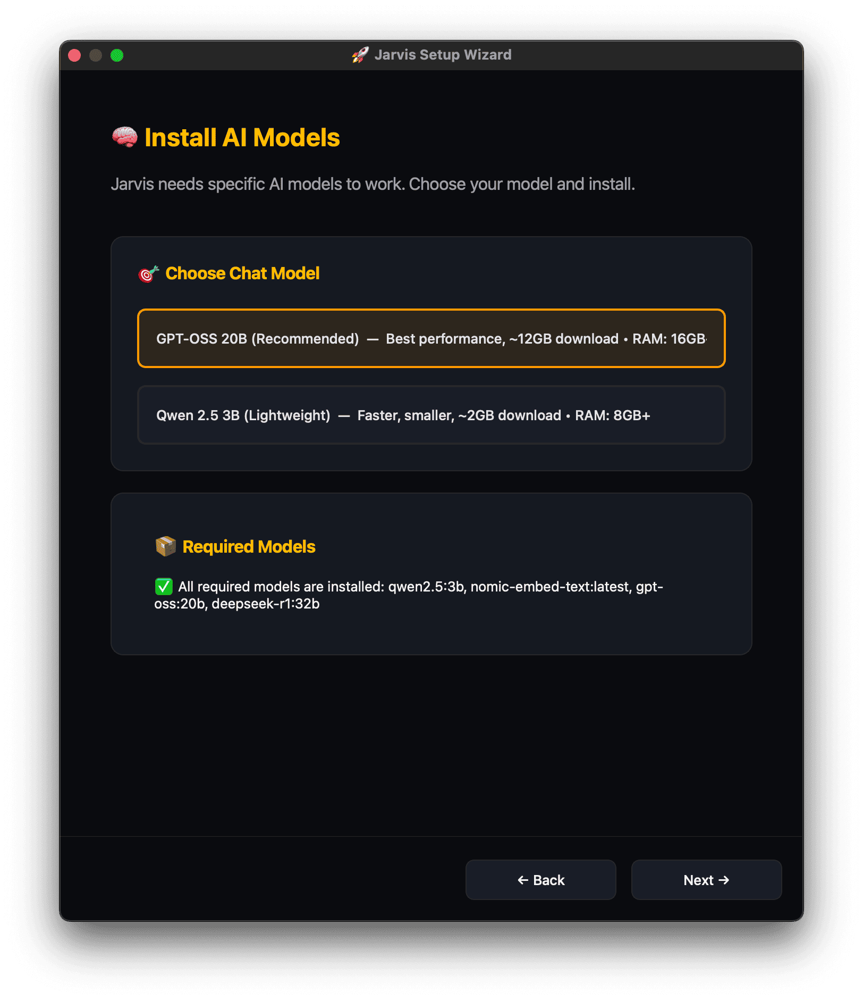
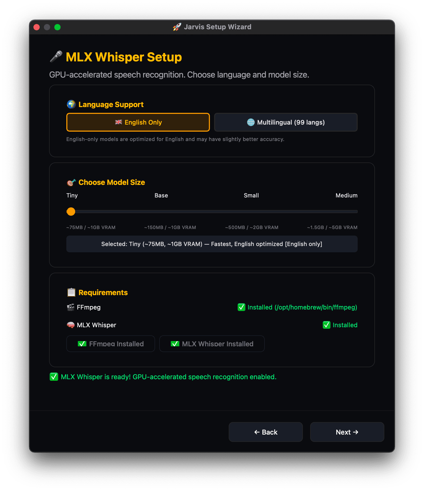

# Jarvis

Your AI assistant that never forgets and runs 100% privately on your computer. Leave it on 24/7 - it learns your preferences, helps with code, manages your health goals, searches the web, and connects to any tool via MCP servers (e.g. home automation). No subscriptions, no cloud, just say "Jarvis" and talk naturally.

---

**Support Jarvis** [](https://github.com/sponsors/isair) [](https://ko-fi.com/isair)

---

<p align="center">
  
</p>

<p align="center">
  
  
</p>

## Why Jarvis?

**🔒 Your data stays yours** - 100% local AI processing. No cloud, no subscriptions, no data harvesting. Automatic redaction of sensitive info. This is non-negotiable.

**🎯 The vision** - A voice assistant that actually remembers you. Unlimited memory across conversations. Context-aware personalities (developer/business/life coach). MCP integration for smart home and 500+ tools.

**📊 Transparent progress** - We track what works (and what doesn't) with automated evals. [See current accuracy →](EVALS.md)

**🚧 Known limitations:** Jarvis is under active development. Primary development happens on macOS. Windows/Linux support may lag behind. We're building in the open, [issues](https://github.com/isair/jarvis/issues) and [contributions](https://github.com/isair/jarvis/pulls) welcome!
- Voice-only for now—no text chat interface yet ([#35](https://github.com/isair/jarvis/issues/35))
- No mobile apps ([#17](https://github.com/isair/jarvis/issues/17))
- "Stop" commands during speech sometimes get filtered as echo ([#24](https://github.com/isair/jarvis/issues/24))

<details>
<summary><strong>See it in action</strong> (example conversations)</summary>

**Personalized news search:**
```
🎙️  Listening for 'jarvis' - say hello!
✨ Working on it: what are some news from today that might interest me?
  🧠 Looking back at our past conversations…
  🌐 Searching the web…

🤖 Jarvis (business)
Here's a quick snapshot of today's headlines...
```

**Health-aware advice:**
```
✨ Working on it: should i order pizza tonight considering my health goals
🧰 Tool: fetchMeals…

🤖 Jarvis (life)
Looking at your week - you mentioned wanting to lose 10 pounds by March...
Today you've had about 860 calories so far. Given your 1,800 calorie target,
you've got room for pizza! But maybe consider thin crust to save calories.
```

**Debugging with screen analysis:**
```
✨ Working on it: i'm getting this weird graphql error
🧰 Tool: screenshot…
🧰 MCP: vscode:findReferences…

🤖 Jarvis (developer)
I can see the error on your screen - "Cannot return null for non-nullable field".
Your User type has `email: String!` but the resolver is returning null...
```

</details>

## Quick Install

### 1. Install Ollama
Download from [ollama.com/download](https://ollama.com/download)

### 2. Download Jarvis

Get the latest from [GitHub Releases](https://github.com/isair/jarvis/releases):

| Platform | Download | Run |
|----------|----------|-----|
| **Windows** | `Jarvis-Windows-x64.zip` | Extract → Run `Jarvis.exe` |
| **macOS** | `Jarvis-macOS-arm64.zip` | Extract → Move to Applications → Right-click → Open |
| **Linux** | `Jarvis-Linux-x64.tar.gz` | `tar -xzf` → Run `./Jarvis/Jarvis` |

Click the system tray icon → **Start Listening** → Say "Jarvis" and talk!

<p align="center">
  
  
  
  
</p>

<p align="center">
  
</p>

## Features

- **Unlimited Memory** - Never forgets. Search across all history. Memory Viewer GUI included.
- **Smart Personalities** - Developer (debugging), Business (planning), Life Coach (health tracking)
- **Built-in Tools** - Screenshot OCR, web search, file access, nutrition tracking, location awareness
- **Voice Interface** - Wake word ("Jarvis"), interruptible ("stop"), natural follow-ups
- **MCP Integration** - Connect to 500+ external tools (Home Assistant, GitHub, Slack, etc.)

## System Requirements

| Hardware | RAM | Model |
|----------|-----|-------|
| Most users | 8GB+ | `llama3.2:3b` (default) |
| High-end | 16GB+ | `gpt-oss:20b` |

The setup wizard will guide you through model selection and installation on first launch.

## Configuration

Most users won't need to change anything. Config file: `~/.config/jarvis/config.json`

<details>
<summary><strong>Speech Recognition (Whisper)</strong></summary>

#### Language Modes
- **English Only** (default, better accuracy): `"whisper_model": "small.en"`
- **Multilingual** (99 languages): `"whisper_model": "small"`

#### Model Sizes
| Model | English | Multilingual | Size | VRAM | Speed |
|-------|---------|--------------|------|------|-------|
| Tiny | `tiny.en` | `tiny` | ~75MB | ~1GB | ~10x |
| Base | `base.en` | `base` | ~150MB | ~1GB | ~7x |
| **Small** | `small.en` | `small` | ~500MB | ~2GB | ~4x |
| Medium | `medium.en` | `medium` | ~1.5GB | ~5GB | ~2x |
| Large V3 Turbo | - | `large-v3-turbo` | ~1.6GB | ~6GB | ~8x |

Speed is relative to original large model. [Source](https://github.com/openai/whisper)

</details>

<details>
<summary><strong>Text-to-Speech</strong></summary>

System TTS works out of the box (Siri voices on macOS, Microsoft on Windows).

**AI Voice with Chatterbox** (requires running from source):
```json
{ "tts_engine": "chatterbox" }
```

**Voice Cloning** - Add a 3-10 second .wav sample:
```json
{
  "tts_engine": "chatterbox",
  "tts_chatterbox_audio_prompt": "/path/to/voice.wav"
}
```

Fine-tuning: `tts_chatterbox_exaggeration` (emotion), `tts_chatterbox_cfg_weight` (quality vs speed)

</details>

<details>
<summary><strong>MCP Tool Integration</strong></summary>

Connect Jarvis to external tools via [MCP servers](https://github.com/topics/mcp-server):

```json
{
  "mcps": {
    "github": {
      "command": "npx",
      "args": ["-y", "@modelcontextprotocol/server-github"],
      "env": { "GITHUB_TOKEN": "your-token" }
    }
  }
}
```

**Popular integrations:**
- **Home Assistant** - Voice control for smart home
- **Google Workspace** - Gmail, Calendar, Drive, Docs
- **GitHub** - Issues, PRs, workflows
- **Notion** - Knowledge management
- **Slack/Discord** - Team communication
- **Databases** - MySQL, PostgreSQL, MongoDB
- **Composio** - 500+ apps in one integration

See [full MCP setup guide](#mcp-integrations) below.

</details>

## MCP Integrations

<details>
<summary><strong>Home Assistant</strong> - Smart home voice control</summary>

1. Add MCP Server integration in Home Assistant (Settings → Devices & services)
2. Expose entities you want to control (Settings → Voice assistants → Exposed entities)
3. Create Long-lived Access Token (Profile → Security → Create token)
4. Install proxy: `uv tool install git+https://github.com/sparfenyuk/mcp-proxy`
5. Add to config:
```json
{
  "mcps": {
    "home_assistant": {
      "command": "mcp-proxy",
      "args": ["http://localhost:8123/mcp_server/sse"],
      "env": { "API_ACCESS_TOKEN": "YOUR_TOKEN" }
    }
  }
}
```

"Jarvis, turn on the living room lights" / "set bedroom to 72°" / "run good night scene"

</details>

<details>
<summary><strong>Google Workspace</strong> - Gmail, Calendar, Drive, Docs, Sheets</summary>

```json
{
  "mcps": {
    "google_workspace": {
      "command": "npx",
      "args": ["-y", "google-workspace-mcp"],
      "env": {
        "GOOGLE_CLIENT_ID": "your-client-id",
        "GOOGLE_CLIENT_SECRET": "your-client-secret"
      }
    }
  }
}
```
Setup: [taylorwilsdon/google_workspace_mcp](https://github.com/taylorwilsdon/google_workspace_mcp)

</details>

<details>
<summary><strong>GitHub</strong> - Repos, issues, PRs, workflows</summary>

```json
{
  "mcps": {
    "github": {
      "command": "npx",
      "args": ["-y", "@modelcontextprotocol/server-github"],
      "env": { "GITHUB_TOKEN": "your-token" }
    }
  }
}
```

</details>

<details>
<summary><strong>Notion, Slack, Discord, Databases</strong></summary>

**Notion:**
```json
{ "mcps": { "notion": { "command": "npx", "args": ["-y", "@makenotion/mcp-server-notion"], "env": { "NOTION_API_KEY": "your-token" } } } }
```

**Slack:**
```json
{ "mcps": { "slack": { "command": "npx", "args": ["-y", "slack-mcp-server"], "env": { "SLACK_BOT_TOKEN": "xoxb-...", "SLACK_USER_TOKEN": "xoxp-..." } } } }
```

**Discord:**
```json
{ "mcps": { "discord": { "command": "npx", "args": ["-y", "discord-mcp-server"], "env": { "DISCORD_BOT_TOKEN": "your-token" } } } }
```

**Databases:** [bytebase/dbhub](https://github.com/bytebase/dbhub) (SQL), [mongodb-mcp-server](https://github.com/mongodb-js/mongodb-mcp-server) (MongoDB)

</details>

<details>
<summary><strong>Composio</strong> - 500+ apps in one integration</summary>

```json
{
  "mcps": {
    "composio": {
      "command": "npx",
      "args": ["-y", "@composiohq/rube"],
      "env": { "COMPOSIO_API_KEY": "your-key" }
    }
  }
}
```
Get API key at [composio.dev](https://composio.dev)

</details>

## Troubleshooting

<details>
<summary><strong>Common issues</strong></summary>

**Jarvis doesn't hear me** - Check microphone permissions, speak clearly after "Jarvis"

**Responses are slow** - Ensure you have enough RAM (8GB+ for default model)

**Windows: App won't start** - Extract full zip first, check Windows Defender

**macOS: "App can't be opened"** - Right-click → Open, or System Settings → Privacy & Security → Allow

**Linux: No tray icon** - `sudo apt install libayatana-appindicator3-1`

</details>

## For Developers

<details>
<summary><strong>Running from source</strong></summary>

```bash
git clone https://github.com/isair/jarvis.git
cd jarvis

# macOS
bash scripts/run_macos.sh

# Windows (with Micromamba)
pwsh -ExecutionPolicy Bypass -File scripts\run_windows.ps1

# Linux
bash scripts/run_linux.sh
```

Running from source enables Chatterbox TTS (AI voice with emotion/cloning).

</details>

<details>
<summary><strong>Privacy hardening</strong> (stay 100% offline)</summary>

```json
{
  "web_search_enabled": false,
  "mcps": {},
  "location_auto_detect": false,
  "location_enabled": false
}
```

Verify: `sudo lsof -i -n -P | grep jarvis` (should only show 127.0.0.1 to Ollama)

</details>

## Privacy & Storage

- **100% offline** - No cloud services required
- **Auto-redaction** - Emails, tokens, passwords automatically removed
- **Local storage** - Everything in `~/.local/share/jarvis`

## License

- **Personal use**: Free forever
- **Commercial use**: [Contact us](mailto:baris@writeme.com)

## Support

[Report issues](https://github.com/isair/jarvis/issues) · [Discussions](https://github.com/isair/jarvis/discussions) · [Sponsor](https://github.com/sponsors/isair)
