# Jarvis

**A 100% private AI voice assistant that lives on your computer** (works offline). Talk naturally as if Toustovač is a third person in the room — say its name anywhere in your sentence and get conversational, context-aware responses. It remembers everything, always knows the current location and time, can search the web, read your screen, control Chrome, track nutrition, and much more with support for unlimited MCPs and tools without context rot. Sensitive info is automatically redacted before anything is saved to disk.

🔒 100% local processing. No subscriptions. No data harvesting. Automatic redaction of sensitive info. Free offline dictation included.

---

**Support Jarvis** [](https://github.com/sponsors/isair) [](https://ko-fi.com/isair)

---

<p align="center">
  
</p>

<p align="center">
  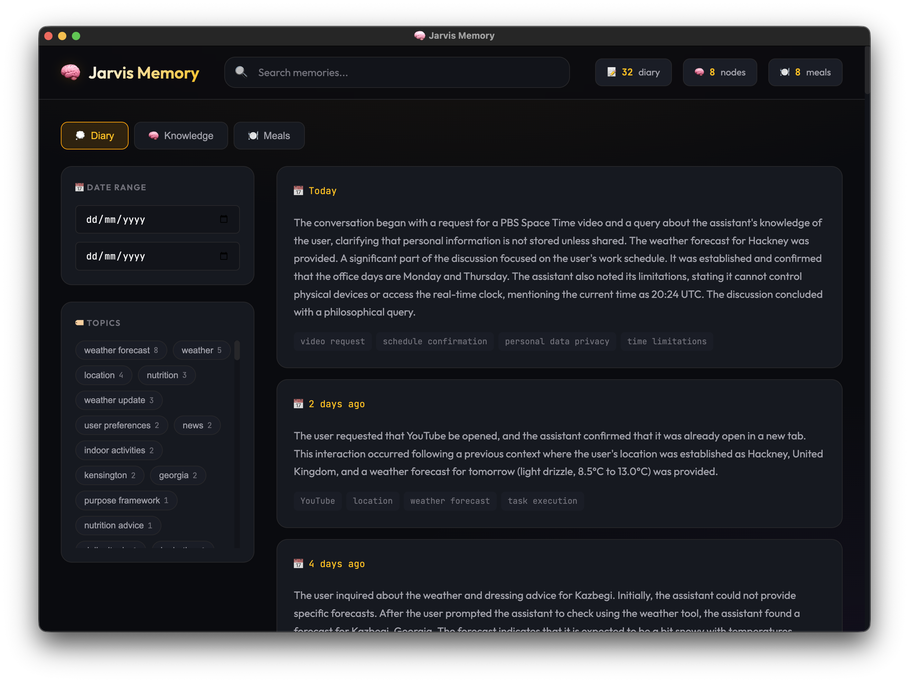
  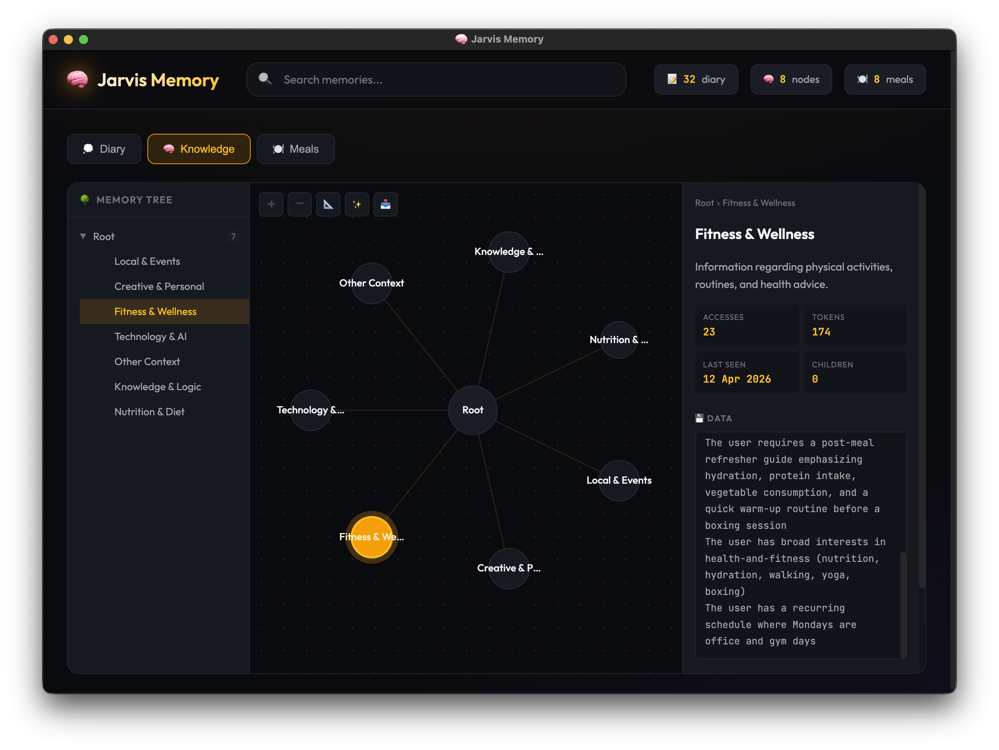
  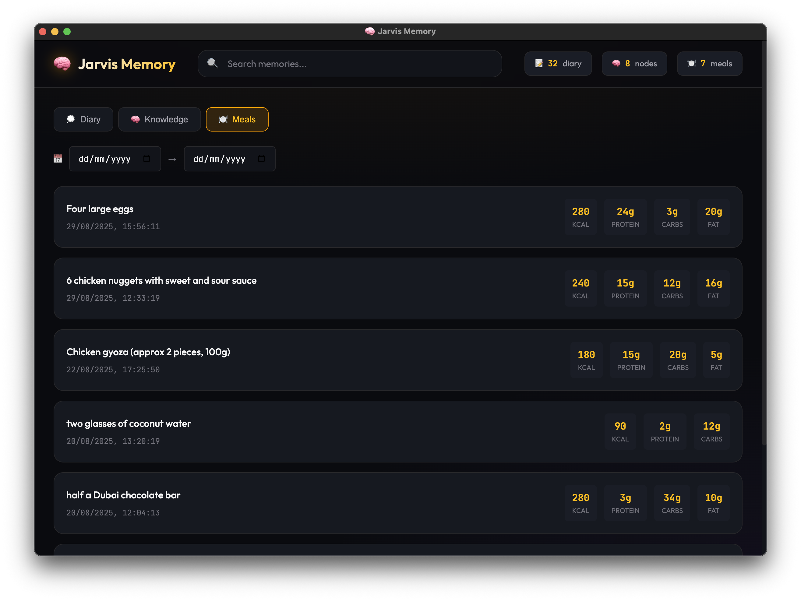
</p>

## Why Toustovač?

**🔒 Your data stays yours** - 100% local AI processing. No cloud, no subscriptions, no data harvesting. Automatic redaction of sensitive info. This is non-negotiable.

**🗣️ A third person in the room** - Unlike voice assistants that only respond to rigid commands, Jarvis understands conversations. It maintains a short temporary rolling context of what's being discussed, so when you ask "Jarvis, what do you think?" it knows exactly what you're talking about. Have it chime into discussions with friends, help debug code while you talk through problems, or weigh in on decisions.

**🧠 Never forgets** - Unlimited memory across conversations. Adapts tone naturally to the topic. Learns your preferences over time.

**🎙️ Free dictation** - Hold a hotkey, speak, release — your words appear in any app as text. Like WisprFlow, but free, offline, and private. No subscription, no cloud transcription.

**🔌 Extensible** - MCP integration connects Jarvis to thousands of tools: smart home, GitHub, Slack, databases, and more. Smart tool selection means adding more tools won't slow things down.

**📊 Transparent progress** - We track what works (and what doesn't) with automated evals. [See current accuracy →](EVALS.md)

**🚧 Known limitations:** Toustovač is under active development. Primary development happens on macOS. Windows/Linux support may lag behind. We're building in the open, [issues](https://github.com/isair/jarvis/issues) and [contributions](https://github.com/isair/jarvis/pulls) welcome!
- No mobile apps ([#17](https://github.com/isair/jarvis/issues/17))
- "Stop" commands during speech sometimes get filtered as echo ([#24](https://github.com/isair/jarvis/issues/24))
- Dictation is not available on macOS 26+ (Tahoe) due to a pynput incompatibility ([#172](https://github.com/isair/jarvis/issues/172))

<details>
<summary><strong>See it in action</strong> (example conversations)</summary>

**Chiming into conversations** (the magic moment):
```
👤 Alice: I wonder what the weather will be like tomorrow
👤 Bob: Yeah, we should check before planning the picnic
👤 Alice: Toustovač, what do you think?
  📝 Heard: "What do you think Jarvis?"
  🧠 Intent (wake word): directed → "what do you think about the weather for the picnic"

✨ Working on it: what do you think about the weather for the picnic
  🧰 Tool: getWeather…
  💬 Generating response...

🤖 Toustovač
Tomorrow looks great for a picnic! Sunny with highs around 22°C...
```
Toustovač understood the entire conversation and gave a contextual answer — no need to repeat the question.

**Browser automation via MCP:**
```
  📝 Heard: "Open YouTube Toustovač."
  🧠 Intent (wake word): directed → "open YouTube"

✨ Working on it: open YouTube
  💬 Generating response...

🤖 Toustovač
I have opened YouTube for you.
```

**Health-aware advice:**
```
  📝 Heard: "Should I order pizza tonight considering my health goals Toustovač?"
  🧠 Intent (wake word): directed → "should I order pizza tonight considering my health goals"

✨ Working on it: should I order pizza tonight considering my health goals
  🧰 Tool: fetchMeals…
  💬 Generating response...

🤖 Toustovač
Looking at your week — you mentioned wanting to lose 5kg by June...
Today you've had about 860 calories so far. Given your 1,800 calorie target,
you've got room for pizza! But maybe consider thin crust to save calories.
```

**Personalised news search:**
```
  📝 Heard: "What are some news from today that might interest me Toustovač?"
  🧠 Intent (wake word): directed → "what are some news from today that might interest me"

✨ Working on it: what are some news from today that might interest me
  🧰 Tool: searchMemory…
  🧰 Tool: webSearch…
  💬 Generating response...

🤖 Toustovač
Here's a quick snapshot of today's headlines...
```

**Natural wake word placement** (say "toustovač" anywhere):
```
  📝 Heard: "Give me a random topic to discuss Toustovač."
  🧠 Intent (wake word): directed → "give me a random topic to discuss"

✨ Working on it: give me a random topic to discuss
  💬 Generating response...

🤖 Toustovač
How about the Fermi Paradox? Given the vast number of stars...
```

**Echo detection** (Jarvis ignores its own speech):
```
🤖 Toustovač
I have opened YouTube for you.

👂 Listening for follow-up (3s)...
  📝 Heard: "I have opened YouTube for you."
  🔇 Heard (echo): "i have opened youtube for you."
💤 Returning to wake word mode
```

</details>

## Quick Install

### 1. Install Prerequisites

| Platform | Requirement |
|----------|-------------|
| **All** | [Ollama](https://ollama.com/download) (default), or any OpenAI-compatible server you already run (LM Studio, Jan, llama.cpp, vLLM, oMLX, LocalAI, …) — see [Configuration → LLM Provider](#configuration) |

### 2. Download Jarvis

Get the latest from [GitHub Releases](https://github.com/isair/jarvis/releases):

| Platform | Download | Run |
|----------|----------|-----|
| **Windows** | `Jarvis-Windows-x64.zip` | Extract → Run `Jarvis.exe` |
| **macOS** | `Jarvis-macOS-arm64.zip` | Extract → Move to Applications → Right-click → Open |
| **Linux** | `Jarvis-Linux-x64.tar.gz` | `tar -xzf` → Run `./Jarvis/Jarvis` |

Jarvis starts listening automatically — just say "Jarvis" and talk!

<p align="center">
  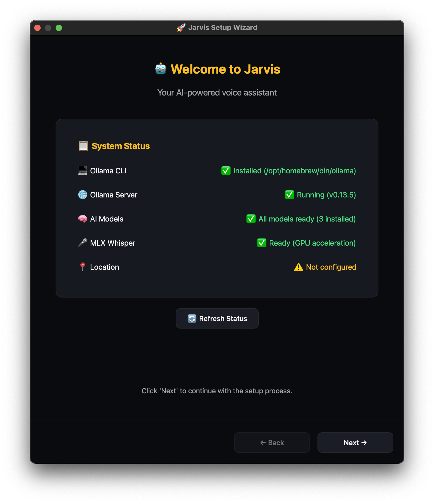
  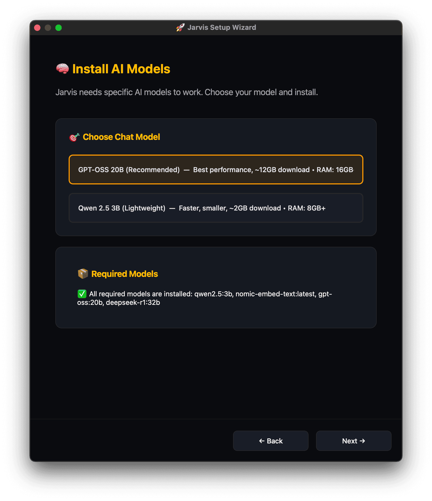
  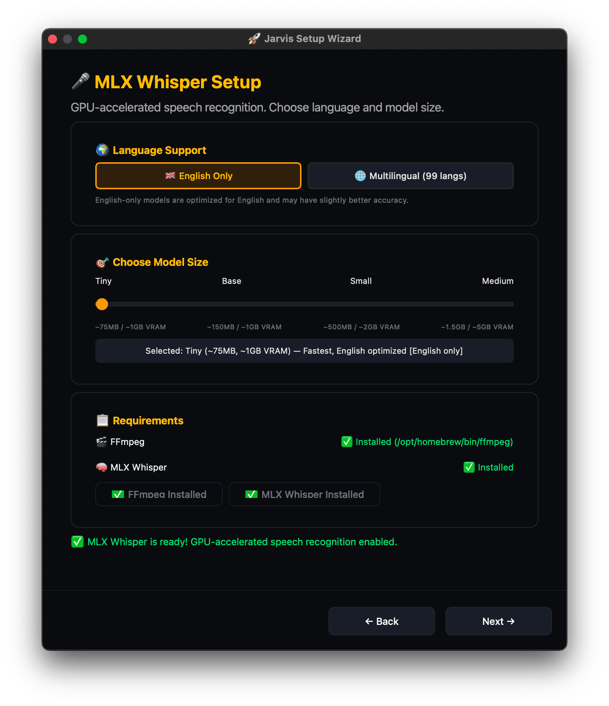
  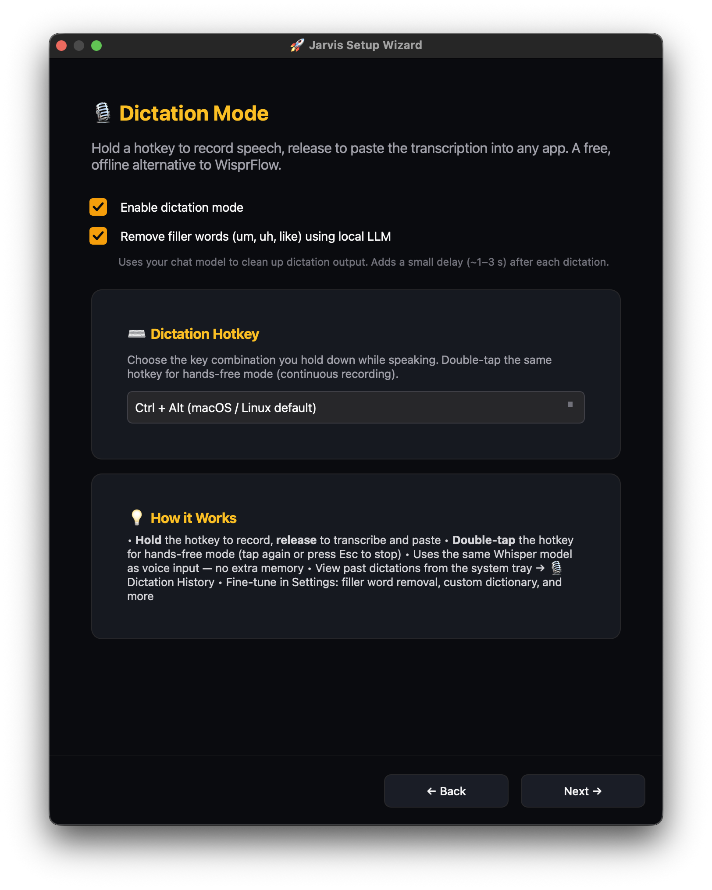
  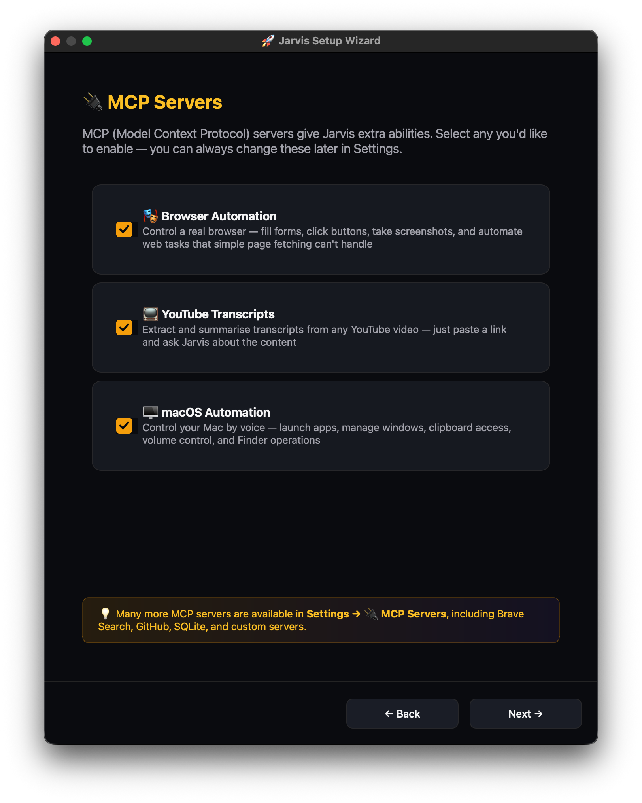
  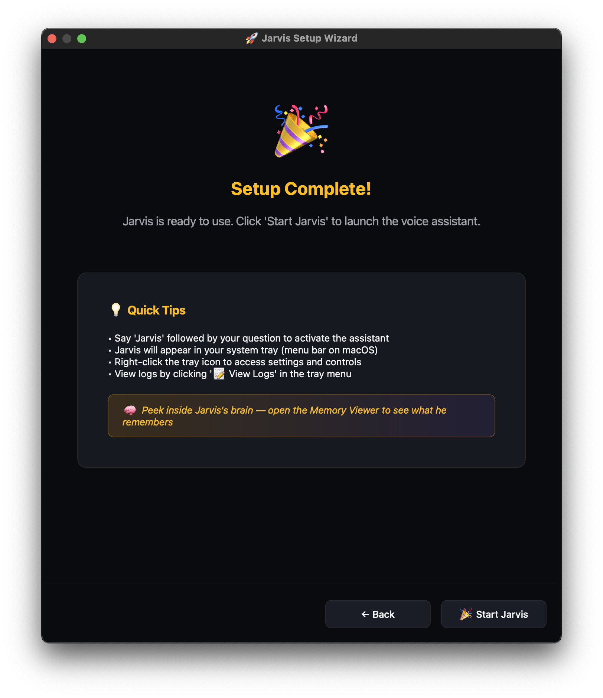
</p>

<p align="center">
  
</p>

## Features

- **Conversational Awareness** - Understands ongoing discussions. Ask "Jarvis, what do you think?" and it knows what you're talking about. Works naturally in multi-person conversations.
- **Text Chat** - Type to Jarvis alongside voice. Voice and text share one conversation, so a follow-up typed in the chat window continues a voice discussion. Text never speaks. Open it from the tray menu (`💬 Chat`) while Jarvis is listening. The window is styled like an SMS thread with a single contact: speech bubbles, timestamps, and an online/typing presence line. It shows a local status banner while Jarvis starts, stops, or needs to be restarted, and every message you send carries a rewind button that rolls the conversation back to that point and regenerates the reply.
- **Unlimited Memory** - Never forgets. Searches across all your conversation history. Memory Viewer GUI included.
- **Adaptive Tone** - Automatically surgical for code, pragmatic for business, encouraging for wellbeing — no manual mode switching
- **Smart Tool Selection** - Embedding-based relevance filtering picks only the tools needed per query — add unlimited MCP tools without performance degradation
- **Built-in Tools** - Screenshot OCR, web search (DuckDuckGo → Brave → Wikipedia fallback chain with auto-fetch), weather, current time in any city or timezone, file access, nutrition tracking, location awareness, plus a tool-discovery escape hatch the agent uses to widen its own toolset mid-reply
- **Knowledge Graph Memory** - Self-organising memory that learns from conversations, auto-splits by topic, and surfaces relevant knowledge automatically
- **Natural Voice** - Say "Jarvis" anywhere in your sentence, interrupt with "stop", follow up without repeating the wake word
- **Dictation Mode** - Free, offline alternative to WisprFlow — hold a hotkey, speak, release to paste text into any app
- **MCP Integration** - Connect to thousands of external tools (Home Assistant, GitHub, Slack, etc.)
- **Voice PE Satellite** - Attaches the stock Home Assistant Voice: Preview Edition as an extra microphone over the Native API: push-to-talk on the centre button with continued conversation, streamed TTS on the device ring, LED phases from the standard assistant events

## System Requirements

| Hardware | VRAM | Model |
|----------|------|-------|
| Low-VRAM / CPU | 2GB+ | `qwen3.5:0.8b` |
| Most users / Intel Arc iGPU (140T, B390, …) | 8GB+ | `gemma4:e2b` (default, Whisper `medium` on CPU int8) |
| Better quality | 16GB+ | `gemma4:e4b` |
| High-end | 24GB+ | `qwen3.8:27b` |

New installs probe hardware at first start and pick the defaults automatically: NVIDIA CUDA (e.g. RTX 4090) selects `qwen3.8:27b` + Whisper `large-v3-turbo` on `cuda` (fast model `qwen3.5:0.8b`); Intel Arc iGPU / NPU (OpenVINO provider present) and plain CPU keep `gemma4:e2b` + `medium` on CPU int8. The probe fails open to the plain-CPU defaults. On the campaign preflight host (Intel Core Ultra 9 285K + Intel Arc 140T + RTX 4090) all three compute targets — CUDA 4090, Arc 140T and the NPU (where OpenVINO packages are installed) — are reported in the startup line `🖥 Compute: …`.

> **Note:** VRAM requirements include the fast model (`gemma4:e2b`) which is always loaded alongside the chat model for voice intent classification and other real-time work. The default chat model shares this, so no extra VRAM is needed.

The setup wizard will guide you through model selection and installation on first launch.

## Configuration

Most users won't need to change anything. Open **⚙️ Settings** from the tray menu to configure Jarvis through a graphical interface — no JSON editing required. Settings are saved to `~/.config/jarvis/config.json`.

<p align="center">
  
  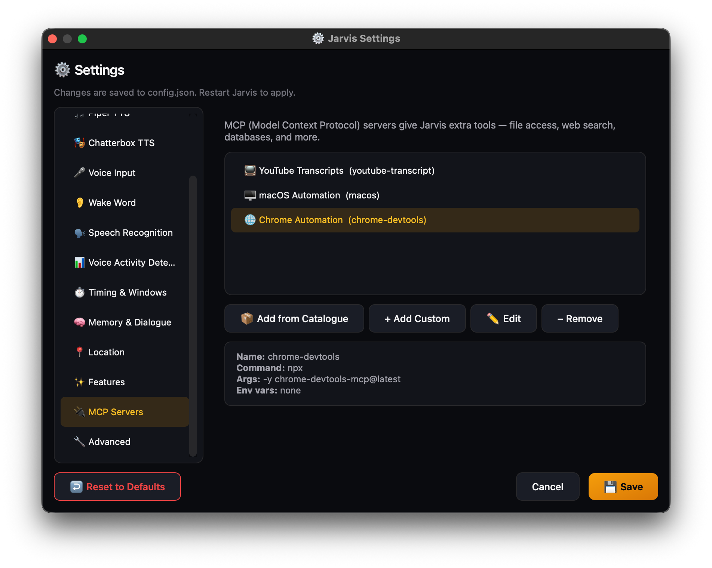
</p>

<details>
<summary><strong>LLM Provider (Ollama or OpenAI-compatible)</strong></summary>

By default Jarvis runs everything locally through [Ollama](https://ollama.com): no API keys, nothing leaves your machine. If you already run an OpenAI-compatible server you can point Jarvis at it instead. Your data still only travels to the servers you control.

Pick the provider in the Setup Wizard's first step, or under **⚙️ Settings → 🔌 LLM Provider**. No JSON editing required. On the OpenAI-compatible page the wizard does the legwork for you: it auto-detects running local servers, offers a one-click preset for your app, and when you press **Connect** it loads the server's model list and checks the chosen model for chat, tool calling, and embeddings, so you know it works before you finish setup.

Tested local servers (all run on your own machine):

| App | Default base URL | Notes |
|-----|------------------|-------|
| LM Studio | `http://localhost:1234/v1` | Chat, tool calling, and embeddings. |
| Ollama (OpenAI API) | `http://localhost:11434/v1` | The native Ollama path is the default; the OpenAI shape works too. |
| Jan | `http://localhost:1337/v1` | Chat and tool calling. |
| llama.cpp (`llama-server`) | `http://localhost:8080/v1` | Tool calling depends on the model. |
| LocalAI | `http://localhost:8080/v1` | Feature support depends on the backend model. |
| vLLM | `http://localhost:8000/v1` | Tool calling depends on the model. |
| oMLX (Apple Silicon) | varies | No embeddings endpoint, so memory uses keyword search unless you route embeddings to Ollama (below). |

For reference, the underlying config keys are:

```json
{
  "llm_provider": "openai_compatible",
  "llm_base_url": "http://localhost:1234/v1",
  "llm_api_key": "",
  "llm_chat_model": "your-served-model-name"
}
```

- `llm_base_url`: your server's OpenAI API base URL.
- `llm_api_key`: only if your server requires one; leave empty otherwise.
- `llm_chat_model`: whatever model name your server exposes.
- `fast_model` (optional): the small, quick model used for real-time work (voice intent, tool routing, quick classifications). Leave empty for automatic: `gemma4:e2b` on Ollama, your chat model on an OpenAI-compatible server. Set it to pin a dedicated small model.

**Embeddings** (used for memory search) can run on a different backend. If your chat server has no embeddings endpoint, memory falls back to keyword search. To keep full semantic memory, route embeddings to Ollama (the wizard offers this automatically when it detects a server that cannot embed):

```json
{
  "embedding_provider": "ollama",
  "embedding_model": "nomic-embed-text"
}
```

Leave `embedding_provider` empty to use the same provider as chat. With no working embeddings, memory search degrades gracefully to keyword search.

</details>

<details>
<summary><strong>Power and Startup</strong></summary>

Jarvis favours fast first responses by default: it warms Whisper, the chat
model, and the intent judge before announcing that it is listening. On Macs or
laptops where heat and battery matter more than instant first-token latency,
enable **⚙️ Settings → ✨ Features → Low Power Mode**.

```json
{
  "low_power_mode": true
}
```

Low Power Mode skips LLM startup warmup and shortens Ollama model residency for
the intent judge from 30 minutes to 1 minute. Whisper still warms so voice input
is ready. The first LLM-backed request after startup or idle may be slower.

</details>

<details>
<summary><strong>Proactive Interruption Modes</strong></summary>

The Toustovač can speak up on its own when something meaningful happens (startup, completed build or download, long silence, low battery, temperature, network change, day windows). Pick a mode in config:

```json
{
  "proactive_mode": "authentic",
  "proactive_min_gap_sec": null,
  "proactive_hour_limit": null
}
```

- `polite`: only critical events (errors, network, battery, build, temperature) or direct user interaction speak; at least 15 min apart, max 2 per hour.
- `authentic` (default, campaign build): proactive offers at contextually amusing moments, at least 90 s apart, max 6 per hour; remarks prefer completed actions and natural silence, never interrupt an utterance.
- `demo`: deterministic scripted triggers for recording videos — no timing-dependent interruptions, counters reset via Demo → Reset Talkie Toaster.

`null` keeps the per-mode defaults (gap 900/90/0 s, limit 2/6/99, in the order above). Direct commands also work in speech and typed chat: `Ticho` / `Buď ticho` / `Přestaň mluvit` suppress all proactive speech until `Můžeš zase mluvit` or restart; `Přestaň nabízet toast` drops the offers for the session; `Teď ne` / `Nyní ne` skips only the current proposal. Any suppression state is visible in `stats()["suppression"]`; every policy-stage failure records `reason=policy_error` (fail-closed).

</details>

<details>
<summary><strong>Speech Recognition (Whisper)</strong></summary>

#### Language Modes
- **Multilingual** (default, 99 languages): `"whisper_model": "medium"`
- **English Only** (slightly better English accuracy): `"whisper_model": "medium.en"`

#### Language Selector And Offline Spell-Check

Pick one transcription language, or keep detection automatic. A fixed code is sent to Whisper as the forced language on the warmup clip and on every utterance (both backends), which lifts transcript precision for that language; `"auto"` keeps per-utterance detection:

```json
{
  "whisper_language": "auto",                            // "auto" detects per utterance, or force one code
  "speech_spellcheck_enabled": true,                     // offline Hunspell repair of the final transcript
  "speech_spellcheck_languages": ["en", "cs", "vi", "sk"], // codes that ship a bundled dictionary
  "speech_spellcheck_protected_terms": []                // extra names/terms kept verbatim
}
```

Four languages are supported: `en` (English), `cs` (Čeština), `vi` (Tiếng Việt), `sk` (Slovenčina). On top of the decoder, an offline Hunspell layer repairs the final transcript only, in the same language: pure-Python `spylls` reads bundled `.aff`/`.dic` pairs, so there is no network round-trip and no system dictionary package to install. Partial, in-progress utterance text keeps Whisper's original form. An unfinished protected word is also completed from the protected vocabulary, so `toastova` comes back as `toastovač`. The protected-token, candidate-ranking, and bypass rules are in `src/jarvis/listening/listening.spec.md`.

All four keys appear in the Settings window under *Whisper*: the language is a dropdown (Auto, English, Čeština, Tiếng Việt, Slovenčina) and the other three are a toggle plus two list editors.

#### Model Sizes
| Model | English | Multilingual | Download | VRAM | Speed |
|-------|---------|--------------|----------|------|-------|
| Tiny | `tiny.en` | `tiny` | ~75 MB | ~1 GB | ~10x |
| Base | `base.en` | `base` | ~140 MB | ~1 GB | ~7x |
| Small | `small.en` | `small` | ~465 MB | ~2 GB | ~4x |
| **Medium** | `medium.en` | `medium` | ~1.5 GB | ~5 GB | ~2x |
| Large V3 Turbo | - | `large-v3-turbo` | ~1.5 GB | ~6 GB | ~8x |

Speed is relative to the original large model. [Source](https://github.com/openai/whisper)

#### GPU Acceleration (Windows)
If you have an NVIDIA GPU, Jarvis can use CUDA for much faster speech recognition. The Windows installer offers an optional CUDA download during setup. For development:
```bash
pip install nvidia-cublas-cu12 nvidia-cudnn-cu12
```
CUDA is detected automatically — no configuration needed.

#### Hallucination Filters
Whisper sometimes produces confident but false transcriptions during silence or background noise (e.g. news-show intros, music). Two thresholds filter these out before they reach the intent judge:

- `"whisper_min_confidence": 0.3` — drops segments whose `avg_logprob`-derived confidence falls below this value. Raise if you see low-confidence noise leaking through; lower if real speech is being dropped.
- `"whisper_no_speech_threshold": 0.5` — drops any segment whose `no_speech_prob` is at or above this value, regardless of `avg_logprob`. Catches the case where Whisper is confident about a hallucinated phrase but its own no-speech signal says the audio was silent. Applies to both the faster-whisper and MLX backends.

Both thresholds are exposed in the Settings window under *Whisper*.

</details>

<details>
<summary><strong>Voice Interface (Advanced)</strong></summary>

**LLM Intent Judge** - Jarvis uses a small LLM for intelligent voice intent classification (echo detection, query extraction, stop commands). On the default Ollama setup this is `gemma4:e2b`, installed automatically alongside your chosen chat model during setup. On an OpenAI-compatible provider the judge uses your served chat model instead, so there is nothing extra to install. The intent judge cannot be disabled but gracefully falls back to simpler text matching if the LLM server is unavailable.

**Tool Router** - When `"tool_selection_strategy": "llm"` (the default), Jarvis asks the fast model to pick which tools are relevant for each query, shrinking the tool catalogue the chat model sees. It's already warm and small enough not to stall the turn. Other strategies: `"keyword"` (fast, no LLM), `"embedding"` (nomic-embed-text), `"all"` (no filtering).

**Task-list Planner** - Before the agentic loop, Jarvis runs a short planning pass that decomposes multi-step queries into an ordered list of sub-tasks. For small models (`gemma4:e2b` class), each planned step is directly resolved to a concrete tool call without relying on the chat model to re-plan turn-by-turn. This significantly improves multi-step reliability. Config options:

```json
{
  "planner_enabled": true,          // set to false to disable the planner entirely
  "planner_timeout_sec": 10.0       // per-call timeout for plan and step-resolver LLM calls
}
```

</details>

<details>
<summary><strong>Small-Model Digest Passes (Advanced)</strong></summary>

Small chat models (~2B, e.g. `gemma4:e2b`) degrade sharply as their prompt grows. Jarvis runs two cheap distil passes to keep the prompt tight:

- **Memory digest** — boils diary + graph recall into a short relevance-filtered note before injecting it as background context.
- **Tool-result digest** — boils a raw tool payload (especially webSearch UNTRUSTED WEB EXTRACT blocks) into a short attributed fact note before it reaches the main reply model.

Both digest passes auto-enable for small models (≤7B) and stay off for large models. For small models, tool-result digest also prevents large fetch_web_page payloads from blowing the context window. Override in `~/.config/jarvis/config.json`:

```json
{
  "memory_digest_enabled": null,          // null = auto-on for SMALL, false to force off, true to force on
  "tool_result_digest_enabled": null,     // null = auto-on for SMALL, false to force off, true to force on
  "llm_digest_timeout_sec": 8.0           // tight ceiling shared by both passes
}
```

Field logs show `🧩 Memory digest: …` and `🧩 Tool digest: …` lines when a pass ran, so you can see when the substrate was replaced.

</details>

<details>
<summary><strong>Voice PE Satellite (Home Assistant Voice: Preview Edition)</strong></summary>

Jarvis can act as the satellite-side client of the stock **Voice: Preview Edition** over the ESPHome Native API on TCP `6053`. Product mode is `Stock Voice PE / push-to-talk + continued conversation`: the centre button opens the first wake-free session and `continue_conversation` carries the follow-ups. The audio path is PCM16LE at 16 kHz mono in, and the same shape out in 512-sample chunks paced against the fixed 512 ms device ring buffer.

```json
{
  "voice_pe_enabled": true,
  "voice_pe_discovery_enabled": true,
  "voice_pe_host": "192.168.1.50",
  "voice_pe_port": 6053,
  "voice_pe_room": "study",
  "voice_pe_disable_wake_words": true,
  "voice_pe_prefer_api_audio": true,
  "voice_pe_preferred_input_channel": 0,
  "voice_pe_continued_conversation": true,
  "voice_pe_conversation_timeout_s": 300.0,
  "voice_pe_reconnect_min_s": 1.0,
  "voice_pe_reconnect_max_s": 30.0,
  "voice_pe_audio_queue_ms": 300,
  "voice_pe_led_brightness": 0.66,
  "voice_pe_led_rgb": [0.55, 0.0, 1.0],
  "voice_pe_button_actions": {
    "double_press": "toggle_overlay",
    "triple_press": "open_command_palette",
    "long_press": "cancel_current_agent_run",
    "easter_egg_press": "toaster_easter_egg"
  }
}
```

The Noise PSK lives inside `voice_pe_devices` in the same `0o600` file (`JARVIS_VOICE_PE_PSK` overrides it in-process), and only its length is ever logged. Stock firmware limits: the rotary encoder publishes no raw wheel entity (the media-player volume is authoritative), the single centre click is resolved on the device, `voice_assistant_leds` is internal and driven by the assistant events, and microphone and TTS are separate phases rather than simultaneous.

Hand-rolled CLI in the existing `sys.argv` style:

```
jarvis voice-pe discover
jarvis voice-pe pair
jarvis voice-pe list
jarvis voice-pe status <device>
jarvis voice-pe set-led <device> --rgb 8c00ff --brightness 0.66
jarvis voice-pe announce <device> "text"
jarvis voice-pe play <device> <url>
jarvis voice-pe stop <device>
jarvis voice-pe forget <device>
```

`forget` removes the Jarvis-side metadata and the local secret and leaves the device itself untouched. `jarvis.integrations/voice_pe/voice_pe.spec.md` holds the full contract.

</details>

## Dictation Mode — Free WisprFlow Alternative

Hold a hotkey to record speech, release to paste the transcription into any app. Works everywhere — your editor, browser, chat, terminal. Completely local, completely free.

<p align="center">
  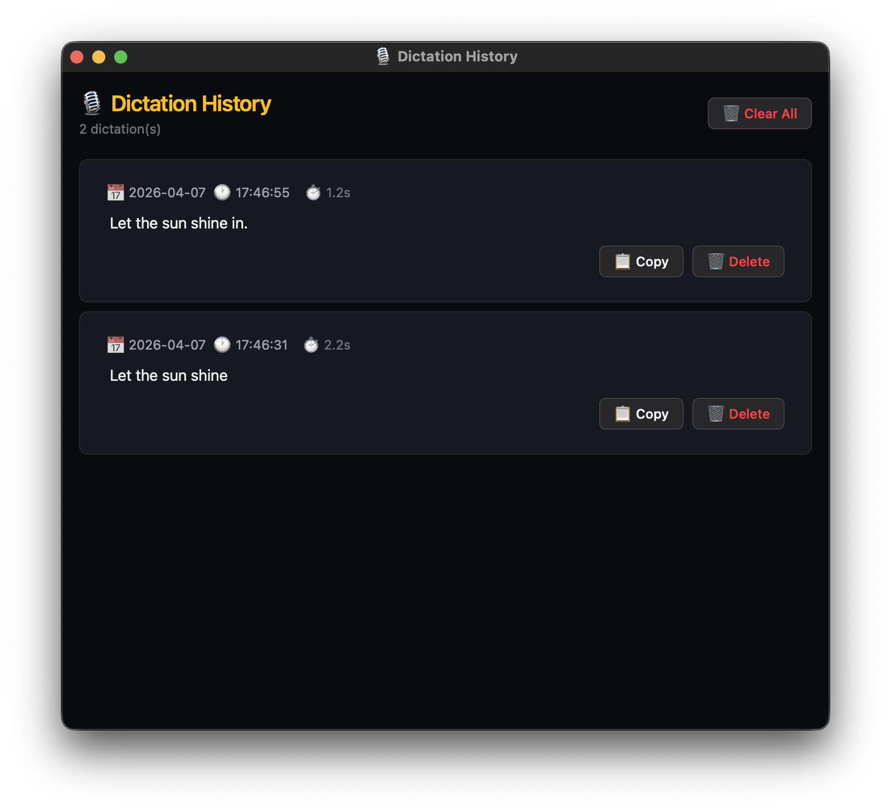
  
</p>

| Platform | Default hotkey |
|----------|---------------|
| **Windows** | Ctrl + Win |
| **macOS** | Ctrl + Option |
| **Linux** | Ctrl + Alt |

- 🔒 **100% offline** — your speech never leaves your machine (unlike cloud dictation services)
- 🧠 **Shared Whisper model** — uses the same speech recognition as voice input, no extra memory
- ⚡ **Zero latency startup** — no server round-trip, transcription starts the moment you release
- 📋 **Universal paste** — works in any app that accepts `Ctrl+V` / `Cmd+V`
- 🔇 **Non-intrusive** — main voice listener pauses automatically during dictation
- ✋ **Hands-free mode** — double-tap the hotkey to keep recording without holding; press again or hit Escape to stop
- 🧹 **Filler word removal** — optional LLM-powered cleanup removes "um", "uh", "like", "you know" while preserving meaning
- 📖 **Custom dictionary** — define `"wrong -> right"` replacements for jargon, names, and technical terms
- 📜 **History window** — browse, copy, or delete past dictations from the system tray
- 🎛️ **Easy setup** — configure dictation during the setup wizard or anytime in Settings (hotkey dropdown, filler removal toggle, custom dictionary editor)

Customise the hotkey in Settings or `config.json`:
```json
{
  "dictation_hotkey": "ctrl+alt",
  "dictation_filler_removal": true,
  "dictation_custom_dictionary": [
    "jarvis -> Jarvis",
    "pytorch -> PyTorch"
  ]
}
```

> **Note:** macOS requires Accessibility permissions for the global hotkey. Linux requires X11 (limited Wayland support).

<details>
<summary><strong>Text-to-Speech</strong></summary>

**Piper TTS (default)** - Neural TTS that auto-downloads on first use (~60MB):
- Works out of the box - no setup required
- High-quality British English male voice (en_GB-alan-medium)
- Fast local synthesis with exact duration tracking

To use different Piper voices, download from [HuggingFace](https://huggingface.co/rhasspy/piper-voices) and set:
```json
{
  "tts_piper_model_path": "~/.local/share/jarvis/models/piper/en_GB-alan-medium.onnx"
}
```

**Chatterbox** - AI voice with emotion control (requires running from source):
```json
{ "tts_engine": "chatterbox" }
```

Voice cloning with Chatterbox - add a 3-10 second .wav sample:
```json
{
  "tts_engine": "chatterbox",
  "tts_chatterbox_audio_prompt": "/path/to/voice.wav"
}
```

</details>

<details>
<summary><strong>Location Detection</strong></summary>

Jarvis can provide location-aware responses (weather, local time, etc.) using a local GeoLite2 database — no cloud geolocation services are used.

**IP detection chain** (in order of preference):
1. **Manual IP** — configure `location_ip_address` in settings
2. **UPnP** — queries your local router (no traffic leaves LAN)
3. **Socket heuristic** — determines which interface routes externally (no data sent)
4. **OpenDNS DNS query** — single `myip.opendns.com` lookup to `208.67.222.222` (only external query)

If your ISP uses carrier-grade NAT (CGNAT), Jarvis automatically resolves your true public IP via the same OpenDNS DNS query. This can be disabled:

```json
{
  "location_cgnat_resolve_public_ip": false
}
```

**Setup:** Register for a free [MaxMind GeoLite2](https://www.maxmind.com/en/geolite2/signup) account, download the City database (MMDB format), and save it to `~/.local/share/jarvis/geoip/GeoLite2-City.mmdb`. The setup wizard will guide you through this.

</details>

<details>
<summary><strong>MCP Tool Integration</strong></summary>

Connect Jarvis to external tools via [MCP servers](https://github.com/topics/mcp-server):

```json
{
  "mcps": {
    "github": {
      "command": "npx",
      "args": ["-y", "@modelcontextprotocol/server-github"],
      "env": { "GITHUB_TOKEN": "your-token" }
    }
  }
}
```

**Popular integrations:**
- **Home Assistant** - Voice control for smart home
- **Google Workspace** - Gmail, Calendar, Drive, Docs
- **GitHub** - Issues, PRs, workflows
- **Notion** - Knowledge management
- **Slack/Discord** - Team communication
- **Databases** - MySQL, PostgreSQL, MongoDB
- **Composio** - 500+ apps in one integration

See [full MCP setup guide](#mcp-integrations) below.

</details>

## MCP Integrations

> **Session persistence:** each MCP server is launched once and its stdio session is kept open across tool calls. Stateful servers (e.g. browser automation, where the server owns a long-running Chrome process) work correctly. If you have a server you'd rather not keep resident, set `"idle_timeout_sec": 300` on its config entry and Jarvis will free it after that long without activity. If a server's tools legitimately run long (e.g. delegating a task to an external CLI agent), set `"timeout_sec": 600` to raise its 120-second default call timeout.

<details>
<summary><strong>Home Assistant</strong> - Smart home voice control</summary>

1. Add MCP Server integration in Home Assistant (Settings → Devices & services)
2. Expose entities you want to control (Settings → Voice assistants → Exposed entities)
3. Create Long-lived Access Token (Profile → Security → Create token)
4. Install proxy: `uv tool install git+https://github.com/sparfenyuk/mcp-proxy`
5. Add to config:
```json
{
  "mcps": {
    "home_assistant": {
      "command": "mcp-proxy",
      "args": ["http://localhost:8123/mcp_server/sse"],
      "env": { "API_ACCESS_TOKEN": "YOUR_TOKEN" }
    }
  }
}
```

"Jarvis, turn on the living room lights" / "set bedroom to 72°" / "run good night scene"

</details>

<details>
<summary><strong>Google Workspace</strong> - Gmail, Calendar, Drive, Docs, Sheets</summary>

```json
{
  "mcps": {
    "google_workspace": {
      "command": "npx",
      "args": ["-y", "google-workspace-mcp"],
      "env": {
        "GOOGLE_CLIENT_ID": "your-client-id",
        "GOOGLE_CLIENT_SECRET": "your-client-secret"
      }
    }
  }
}
```
Setup: [taylorwilsdon/google_workspace_mcp](https://github.com/taylorwilsdon/google_workspace_mcp)

</details>

<details>
<summary><strong>GitHub</strong> - Repos, issues, PRs, workflows</summary>

```json
{
  "mcps": {
    "github": {
      "command": "npx",
      "args": ["-y", "@modelcontextprotocol/server-github"],
      "env": { "GITHUB_TOKEN": "your-token" }
    }
  }
}
```

</details>

<details>
<summary><strong>Notion, Slack, Discord, Databases</strong></summary>

**Notion:**
```json
{ "mcps": { "notion": { "command": "npx", "args": ["-y", "@makenotion/mcp-server-notion"], "env": { "NOTION_API_KEY": "your-token" } } } }
```

**Slack:**
```json
{ "mcps": { "slack": { "command": "npx", "args": ["-y", "slack-mcp-server"], "env": { "SLACK_BOT_TOKEN": "xoxb-...", "SLACK_USER_TOKEN": "xoxp-..." } } } }
```

**Discord:**
```json
{ "mcps": { "discord": { "command": "npx", "args": ["-y", "discord-mcp-server"], "env": { "DISCORD_BOT_TOKEN": "your-token" } } } }
```

**Databases:** [bytebase/dbhub](https://github.com/bytebase/dbhub) (SQL), [mongodb-mcp-server](https://github.com/mongodb-js/mongodb-mcp-server) (MongoDB)

</details>

<details>
<summary><strong>Composio</strong> - 500+ apps in one integration</summary>

```json
{
  "mcps": {
    "composio": {
      "command": "npx",
      "args": ["-y", "@composiohq/rube"],
      "env": { "COMPOSIO_API_KEY": "your-key" }
    }
  }
}
```
Get API key at [composio.dev](https://composio.dev)

</details>

## Troubleshooting

<details>
<summary><strong>Common issues</strong></summary>

**First startup takes a bit** - Jarvis pre-warms the Whisper, chat, and intent-judge models before announcing "Listening!" so the first engagement feels instant. This adds a few seconds on cold start and is bounded at 60 s. If Ollama is slow, Jarvis will start listening anyway and load the models on demand. Enable **Low Power Mode** in Settings to skip LLM startup warmup.

**Jarvis doesn't hear me** - Check microphone permissions, speak clearly after "Jarvis"

**Not sure what is running** - Open the tray menu and click **🩺 Runtime Status**. It shows whether Jarvis is listening, whether Low Power Mode is active, whether Ollama is needed/running, which models are configured, and how many MCP servers are enabled.

**Responses are slow** - Ensure you have enough VRAM (8GB+ for default model; see System Requirements for other models)

**Mac gets warm while Jarvis is active** - Enable **⚙️ Settings → ✨ Features → Low Power Mode**. This keeps voice recognition ready while avoiding background LLM warmup and shortening Ollama's idle residency window.

**Mac is still warm after quitting** - If Jarvis starts Ollama for you, quitting Jarvis also stops that owned Ollama runtime. If Ollama was already running before Jarvis opened, Jarvis leaves it running so it does not interrupt your other local AI tools.

**Windows: App won't start** - Extract full zip first, check Windows Defender

**macOS: "App can't be opened"** - Right-click → Open, or System Settings → Privacy & Security → Allow

**Linux: No tray icon** - `sudo apt install libayatana-appindicator3-1`

**Jarvis keeps deflecting on questions it answered before** - small models can record their own past failures into the diary, which then primes future sessions to repeat them. New writes are scrubbed automatically; to clean historical entries, open the Memory Viewer, switch to the Diary tab, and click **Clean up deflection narration** in the sidebar Maintenance section. Only sentences that narrate the assistant's failures are removed; the rest of each entry stays.

</details>

## For Developers

<details>
<summary><strong>Running from source</strong></summary>

```bash
git clone https://github.com/isair/jarvis.git
cd jarvis

# macOS
bash scripts/run_macos.sh

# Windows (with Micromamba)
pwsh -ExecutionPolicy Bypass -File scripts\run_windows.ps1

# Linux
bash scripts/run_linux.sh
```

Running from source enables Chatterbox TTS (AI voice with emotion/cloning). Piper TTS works in both bundled and source modes.

</details>

<details>
<summary><strong>Privacy hardening</strong> (stay 100% offline)</summary>

```json
{
  "web_search_enabled": false,
  "wikipedia_fallback_enabled": false,
  "brave_search_api_key": "",
  "mcps": {},
  "location_auto_detect": false,
  "location_cgnat_resolve_public_ip": false,
  "location_enabled": false
}
```

Verify: `sudo lsof -i -n -P | grep jarvis` (should only show 127.0.0.1 to Ollama)

</details>

<details>
<summary><strong>Web search fallback chain</strong></summary>

When DuckDuckGo is rate-limited or returns nothing fetchable, Jarvis walks
a small fallback chain before giving up rather than confabulating:

1. **Brave Search** — opt-in, requires `brave_search_api_key`. Free tier:
   2,000 queries/month. Get a key at
   [api.search.brave.com](https://api.search.brave.com/app/keys).
2. **Wikipedia** — zero-config, on by default, uses the Wikipedia host
   matching the language Whisper auto-detected on the utterance (so a
   Turkish question gets a Turkish answer). Disable with
   `wikipedia_fallback_enabled: false`.
3. **Honest failure** — if every provider fails, the reply tells you the
   search was blocked rather than making something up.

The whole chain is bounded by a ~20s wall-clock deadline so a stalled
provider can't run out the voice-assistant latency budget.

</details>

## Privacy & Storage

- **100% offline** - No cloud services required
- **Auto-redaction** - Emails, tokens, passwords automatically removed
- **Local storage** - Everything in `~/.local/share/jarvis`

## License

- **Personal use**: Free forever
- **Commercial use**: [Contact us](mailto:baris@writeme.com)

## Support

[Report issues](https://github.com/isair/jarvis/issues) · [Discussions](https://github.com/isair/jarvis/discussions) · [Sponsor](https://github.com/sponsors/isair)
