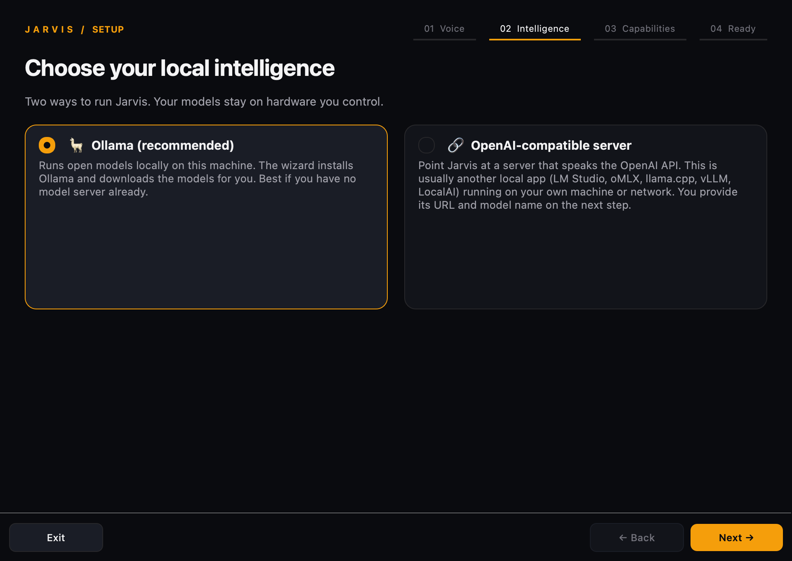
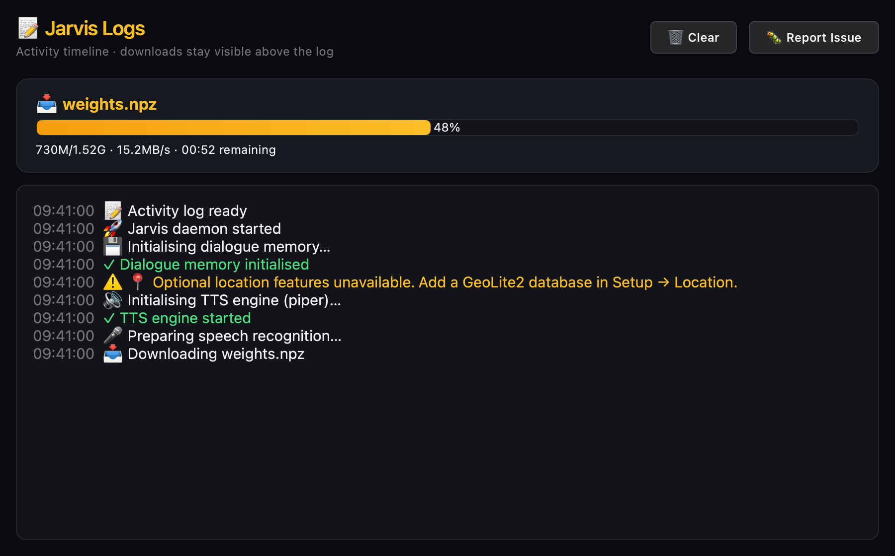
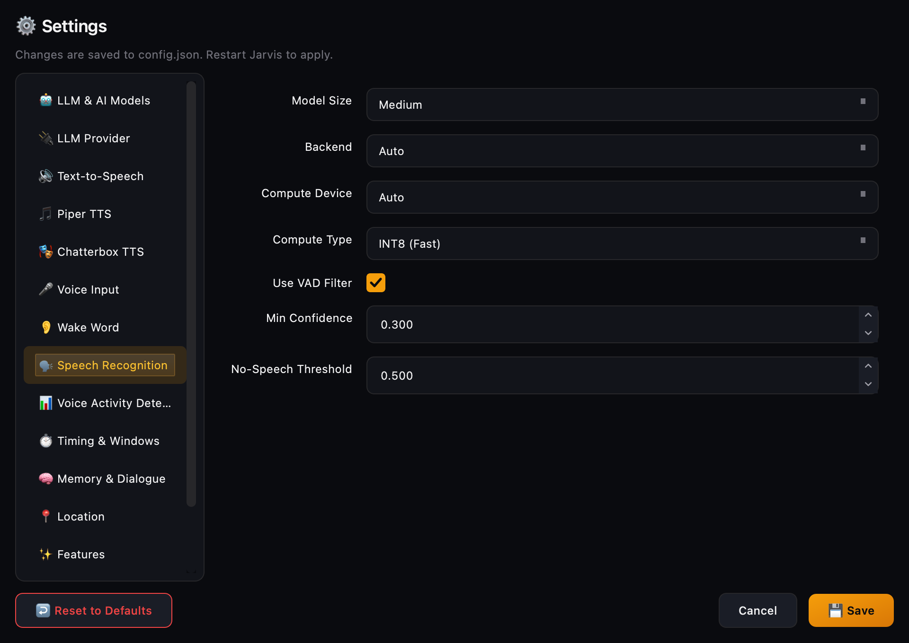
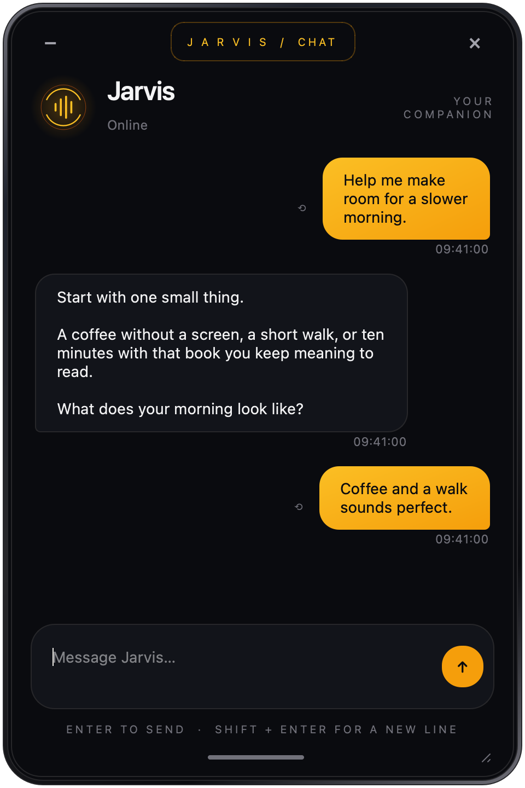

<div align="center">

# Jarvis

### Your intelligence. Your hardware.

A private, local-first voice assistant that lives on your computer.<br>
Talk naturally, as if Jarvis were a third person in the room.

**Voice-first · Local AI · Personal memory · No subscription**

[**Download Jarvis →**](https://github.com/isair/jarvis/releases) &nbsp; · &nbsp; [Get started](#quick-install) &nbsp; · &nbsp; [Explore the app](#inside-jarvis) &nbsp; · &nbsp; [Support the project](#support)

</div>

---

## An assistant that lives with you, not in the cloud

Jarvis is built to be part of the conversation, not another screen to type into. Talk through an idea, discuss plans with a friend, then ask “Jarvis, what do you think?” While listening, it keeps a short, temporary rolling transcript of nearby speech so it can join an ongoing conversation using what was just discussed, without you having to repeat the background.

Say “Jarvis” anywhere in a sentence and follow up naturally. Speech recognition, language models and speech synthesis run on hardware you control. The animated face gives your voice assistant a presence on the desktop; chat is there when you would rather type.

Your conversation memory stays on your computer. Sensitive information is redacted before it reaches model context or the saved diary. Web search, weather and connected tools use the network when you ask for those capabilities; local conversation does not require a cloud AI account.

<p align="center">
  
</p>

<p align="center"><sub>A voice, a face, and a place in the conversation.</sub></p>

## Quick Install

**1. Download the app.** Choose your platform from [GitHub Releases](https://github.com/isair/jarvis/releases).

| Platform | Package | Open |
| :--- | :--- | :--- |
| macOS · Apple Silicon | `Jarvis-macOS-arm64.zip` | Extract, move to Applications, then right-click → Open |
| macOS · Intel | `Jarvis-macOS-x64.zip` | Extract, move to Applications, then right-click → Open |
| Windows · x64 | `Jarvis-Windows-x64.zip` | Extract, then run `Jarvis.exe` |
| Linux · x64 | `Jarvis-Linux-x64.tar.gz` | Extract, then run `./Jarvis/Jarvis` |

**2. Choose your local models.** The setup wizard guides you through speech recognition and a model server. Use [Ollama](https://ollama.com/download), or connect an OpenAI-compatible server you already run, such as LM Studio, oMLX or llama.cpp.

**3. Make it yours.** Allow microphone access and let the first model downloads finish. When Jarvis reports that it is listening, try:

> “Jarvis, help me think through my day.”

Open **Chat** from the tray menu when you would rather type. Text replies are silent.

<details>
<summary><strong>Hardware and model choices</strong></summary>

Memory needs depend on model size, quantisation, context length and speech recognition. The setup wizard helps you choose; smaller models trade capability for lower resource use.

| Starting point | Chat model |
| :--- | :--- |
| Smaller hardware | `qwen3.5:0.8b` |
| Default | `gemma4:e2b` |
| More capable | `gemma4:e4b` |
| Larger local setup | `qwen3.8:27b` |

Budget memory for Whisper and, when different from chat, the fast model used for voice intent and tool routing. Apple Silicon uses unified memory; other GPUs use dedicated VRAM.

</details>

## What you can do

- **A third person in the room.** Bring Jarvis into an ongoing conversation with friends, talk through a problem aloud, or ask it to weigh in on a decision. “Jarvis, what do you think?” draws on the recent discussion, not just that one sentence.
- **Remember beyond one session.** Search your local diary and knowledge graph. Browse what Jarvis has stored in the Memory Viewer.
- **Get things done.** Built-in tools cover web search, weather, time, screenshot OCR, file access, nutrition tracking and optional location awareness.
- **Connect your own tools.** MCP servers add browser automation, smart-home controls and other integrations. Tool routing selects a relevant subset for each request.
- **Dictate into other apps.** Hold a hotkey, speak, then release to paste locally transcribed text. See the [platform limitations](#known-limitations) first.
- **Type when you need to.** The companion chat shares your voice conversation and memory. Text replies are silent, and you can rewind a sent message to regenerate from that point.

### Bring Jarvis into the discussion

> **You:** We could have a picnic tomorrow.
>
> **A friend:** Depends on the weather. Should we plan something indoors instead?
>
> **You:** Jarvis, what do you think?

Jarvis can use the recent conversation to understand that you are asking about the weather for the picnic, rather than treating the last sentence as an isolated question. This is the experience it is built around. How reliably it understands the context depends on speech recognition and your chosen model; see the [evaluation results](EVALS.md).

## Inside Jarvis

The supporting desktop interfaces keep setup, activity and settings within reach. The screenshots below use current widgets with demo data, each on its own row so you can read the interface without opening an image viewer.

### A guided start

Choose the runtime that fits your machine. Setup walks through local models, speech and optional capabilities without requiring you to edit a configuration file.

<p align="center">
  
</p>

### Progress you can actually follow

The activity timeline keeps ordinary events readable. Downloads have a separate card with transferred bytes, percentage, speed and remaining time when the downloader provides them. Loading and warmup are distinct stages.

<p align="center">
  
</p>

### Your setup, without the JSON

Choose models, tune speech recognition, configure tools and enable Low Power Mode from **Settings** in the tray menu.

<p align="center">
  
</p>

### A quiet companion to voice

When speaking is inconvenient, open Chat from the tray. It picks up the same conversation and memory, without reading text replies aloud.

<p align="center">
  
</p>

## Known limitations

Jarvis is actively developed, primarily on macOS. Windows and Linux behaviour may differ. Model choice and hardware affect response quality and speed; [automated evaluation results](EVALS.md) show what is being measured.

- **macOS 26+ dictation is unavailable** because of a pynput incompatibility ([#172](https://github.com/isair/jarvis/issues/172)). This limitation concerns the global dictation hotkey.
- **Spoken “stop” can be mistaken for echo** while Jarvis is speaking ([#24](https://github.com/isair/jarvis/issues/24)).
- **No mobile app** is available ([#17](https://github.com/isair/jarvis/issues/17)).
- **First-run downloads can take time.** Whisper and language models can be large. Check Logs for progress before assuming startup is stuck.
- **Optional capabilities need their dependencies.** Location awareness needs a GeoLite2 database. Semantic memory search needs working embeddings; otherwise search falls back to keywords.

## Configuration

Most people can use **Settings** from the tray. Advanced setups can edit `~/.config/jarvis/config.json`.

[**Open the configuration guide →**](docs/CONFIGURATION.md)

The guide covers local model servers, speech recognition, Low Power Mode, voices, dictation, location, MCP integrations and troubleshooting.

### Dictation at a glance

| Platform | Default hotkey |
| :--- | :--- |
| Windows | Ctrl + Win |
| macOS, where supported | Ctrl + Option |
| Linux | Ctrl + Alt |

Hold to record and release to paste. Double-tap for hands-free recording. Optional filler-word removal, a custom dictionary and dictation history are available in Settings. macOS needs Accessibility permission; Linux requires X11, with limited Wayland support.

### Bring your own tools

Connect MCP servers for browser automation, Home Assistant, GitHub, databases and more. Credentials and network access depend on the tools you choose. Review a server's permissions before enabling it.

[Integration examples and server settings →](docs/CONFIGURATION.md#mcp-integrations)

## Troubleshooting

<details>
<summary><strong>Linux says Listening, but never hears speech</strong></summary>

Check Logs for missing-callback or silent-input warnings. Verify the recording source and mute state in PipeWire/PulseAudio, and select a microphone rather than an output monitor. Enable `voice_debug` in Settings for capture-level diagnostics. See the [troubleshooting guide](docs/CONFIGURATION.md#troubleshooting).

</details>

<details>
<summary><strong>Downloads look paused</strong></summary>

Open **Logs** from the tray. The progress card shows transfer details when available and elapsed waiting time when updates pause. After downloading, loading the model into memory is a separate step.

</details>

<details>
<summary><strong>Warmup passed, but a request timed out</strong></summary>

Warmup checks model loading with a small probe, not a full request. Voice intent detection has a separate timeout from chat. Check the limit shown in the log and your local server's responsiveness.

</details>

<details>
<summary><strong>The Mac gets warm, or I want lower background usage</strong></summary>

Enable **Settings → Features → Low Power Mode**. It skips LLM startup warmup and shortens Ollama model residency while keeping speech recognition ready. The first model request after idle may take longer.

</details>

[More troubleshooting →](docs/CONFIGURATION.md#troubleshooting)

## For Developers

<details>
<summary><strong>Run from source</strong></summary>

```bash
git clone https://github.com/isair/jarvis.git
cd jarvis

# macOS
bash scripts/run_macos.sh

# Windows (PowerShell, with Micromamba)
pwsh -ExecutionPolicy Bypass -File scripts\run_windows.ps1

# Linux
bash scripts/run_linux.sh
```

Running from source also enables Chatterbox TTS. Piper works in both packaged and source installations.

</details>

<details>
<summary><strong>Refresh the screenshots</strong></summary>

With the desktop dependencies installed in your Python environment:

```bash
PYTHONPATH=src python scripts/capture_readme_screenshots.py
```

The capture script uses the real widgets and illustrative data, isolates configuration in a temporary directory, and blocks network connections and background workers. It does not launch the daemon or use personal conversations. Keep screenshots on separate rows at readable widths.

</details>

[Evaluation results](EVALS.md) · [Report a bug](https://github.com/isair/jarvis/issues) · [Contribute](https://github.com/isair/jarvis/pulls)

## Privacy & Storage

Local AI is the default, not a paid upgrade. No cloud AI service is required.

- **Conversation memory:** stored locally under `~/.local/share/jarvis`.
- **Sensitive information:** redacted before model context and saved diary entries. The in-memory chat still shows what you typed.
- **Network boundaries:** model downloads, web tools and enabled integrations can make network requests. An external model endpoint receives the requests you send to it.

<details>
<summary><strong>Reduce optional network access</strong></summary>

Use a local model endpoint, download the required models first, disable web tools and leave MCP integrations empty. These settings turn off search and automatic location detection:

```json
{
  "web_search_enabled": false,
  "wikipedia_fallback_enabled": false,
  "brave_search_api_key": "",
  "mcps": {},
  "location_auto_detect": false,
  "location_cgnat_resolve_public_ip": false,
  "location_enabled": false
}
```

These options are not a network firewall. Other online tools and app update checks may still use the network; enforce network restrictions separately if required.

</details>

## Support

Jarvis is **free for personal use**. For commercial use, [get in touch](mailto:baris@writeme.com).

If it earns a place on your desktop, help keep it growing.

[**Sponsor on GitHub**](https://github.com/sponsors/isair) · [Buy a coffee](https://ko-fi.com/isair) · [Join the discussion](https://github.com/isair/jarvis/discussions)
