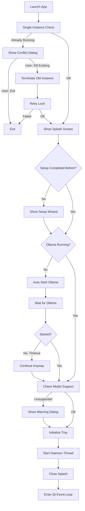
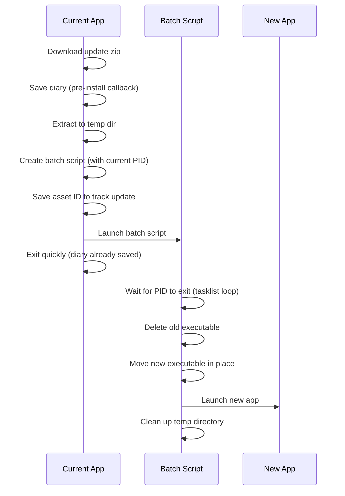

# Desktop App Specification

This document outlines the architecture and behavior of the Jarvis Desktop App - a cross-platform PyQt6 system tray application that provides a graphical interface for the Jarvis voice assistant.

## Overview

The desktop app is a **separate package** from the core `jarvis` module. It depends on `jarvis` for assistant functionality but `jarvis` has no knowledge of or dependency on the desktop app. This separation allows:

- Running Jarvis headless (CLI/daemon only)
- Building alternative UIs (web, mobile) without modifying core logic
- Keeping PyQt6 dependencies isolated from the core package

## Package Structure

```
src/desktop_app/
├── __init__.py          # Package exports, main() entry point
├── app.py               # JarvisSystemTray, windows, startup flow
├── splash_screen.py     # Animated startup splash
├── setup_wizard.py      # First-run setup wizard
├── face_widget.py       # Animated face visualization
├── themes.py            # Qt stylesheets and color palette
├── diary_dialog.py      # End-of-session diary update dialog
├── memory_viewer.py     # Flask-based memory browser
├── updater.py           # Update checking logic
├── update_dialog.py     # Update notification dialogs
└── desktop_assets/      # Icons and images
```

## Startup Flow

The startup sequence ensures a smooth user experience even when dependencies (like Ollama) aren't ready.



### Key Startup Features

1. **Splash Screen**: Shows immediately to provide visual feedback while loading
2. **Ollama Auto-Start**: If Ollama isn't running, automatically starts it (up to 15s wait)
3. **Single Instance Lock**: Prevents multiple copies from running simultaneously. If another instance is detected, shows a dialog offering to close the existing instance and start fresh.
4. **Crash Detection**: Detects previous crashes and offers to submit bug reports
5. **Single QApplication**: The QApplication is created **once** at the very start of `main()`, before the instance lock check. This is critical because Qt only allows one QApplication per process lifetime — creating a temporary one for a dialog and then another for the main app causes undefined behaviour.

### Windows DLL Handling

On Windows, bundled (PyInstaller) apps must ensure the correct native DLLs are loaded. Two mechanisms work together:

1. **PyInstaller runtime hook** (`pyinstaller_runtime_hook.py`): Runs before *any* user Python code. Calls `os.add_dll_directory()` for `_MEIPASS` root and `onnxruntime/capi/` so the bundled `onnxruntime.dll` is found before the system-wide copy in `C:\Windows\System32`.
2. **`jarvis/__init__.py` guard**: A second line of defence that registers the same DLL directories when the `jarvis` package is first imported. This covers edge cases where the runtime hook hasn't run (e.g. running the daemon via `python -m jarvis` in a frozen-like environment).

Without these, Windows loads `C:\Windows\System32\onnxruntime.dll` (an older, smaller build) instead of the pip-installed version, causing an API mismatch crash in faster-whisper's Silero VAD.

## Main Components

### JarvisSystemTray

The central controller that manages:

- **System tray icon** with context menu
- **Daemon lifecycle** (start/stop the Jarvis voice assistant)
- **Window management** (log viewer, memory viewer, face window)
- **Update checking** on startup and on-demand

### Windows

| Window | Purpose |
|--------|---------|
| **LogViewerWindow** | Real-time log output from the daemon, with "Report Issue" button |
| **MemoryViewerWindow** | Web-based memory browser (Flask server) |
| **FaceWindow** | Animated face that reacts to speaking state |
| **SetupWizard** | First-run configuration (Ollama, models, profile) |

### LogViewerWindow Features

- Real-time log streaming from daemon
- Monospace font for readability (JetBrains Mono on macOS, Consolas elsewhere)
- **Report Issue button**: Opens GitHub issue with:
  - Pre-filled bug report template
  - Auto-redacted log contents (emails, tokens, JWTs, passwords, etc.)
  - Logs in collapsible `<details>` section
  - Version and platform info

### Splash Screen

Animated loading screen shown during startup with:

- Pulsing orb animation (matches theme colors)
- Status text updates ("Checking Ollama...", "Starting daemon...")
- Frameless, centered, always-on-top

## Daemon Integration

The desktop app runs the Jarvis daemon in a **QThread** (bundled mode) or **subprocess** (development mode).

```
┌─────────────────────────────────────────┐
│           Desktop App (Main Thread)      │
│  ┌─────────────────────────────────┐    │
│  │         Qt Event Loop            │    │
│  │  - Tray icon interactions        │    │
│  │  - Window management             │    │
│  │  - Signal/slot communication     │    │
│  └─────────────────────────────────┘    │
│                   │                      │
│                   │ signals              │
│                   ▼                      │
│  ┌─────────────────────────────────┐    │
│  │      DaemonThread (QThread)      │    │
│  │  - Runs jarvis.daemon.main()     │    │
│  │  - Captures stdout/stderr        │    │
│  │  - Emits logs to LogViewer       │    │
│  └─────────────────────────────────┘    │
└─────────────────────────────────────────┘
```

### Daemon Callbacks

The desktop app registers callbacks with the daemon for:

- **Diary updates**: Shows DiaryUpdateDialog when session ends
- **Clean shutdown**: Ensures graceful exit with diary save

#### Bundled Mode (QThread)

In bundled mode, the daemon runs in the same process, so callbacks can be set directly via `set_diary_update_callbacks()`. The DiaryUpdateDialog receives:
- `on_chunks`: List of conversation chunks being summarized
- `on_token`: Streaming tokens as the diary is generated
- `on_status`: Status messages ("Writing diary entry...")
- `on_complete`: Completion signal (success/failure)

#### Subprocess Mode (Development)

In subprocess mode, the daemon runs as a separate process. IPC is achieved via stdout:
- Daemon emits JSON events prefixed with `__DIARY__:` (e.g., `__DIARY__:{"type":"token","data":"Hello"}`)
- Desktop app intercepts these lines from the log stream
- DiaryUpdateDialog's `process_log_line()` parses and emits signals
- Same UI experience as bundled mode

## Theme System

All UI components use a consistent dark theme defined in `themes.py`:

```python
COLORS = {
    "bg_primary": "#09090b",      # Deep space black
    "bg_secondary": "#18181b",    # Slightly lighter
    "accent_primary": "#f59e0b",  # Amber
    "accent_secondary": "#fbbf24", # Lighter amber
    "text_primary": "#fafafa",    # White
    "text_secondary": "#a1a1aa",  # Muted
    ...
}
```

Components use `JARVIS_THEME_STYLESHEET` for consistent styling across all dialogs and windows.

## Update System

The desktop app includes an auto-update mechanism:

1. **Check**: Queries GitHub releases API for newer versions
2. **Notify**: Shows dialog with changelog and download option
3. **Download**: Downloads new installer with progress bar
4. **Install**: Platform-specific installation (see below)

Updates are only available in bundled mode (PyInstaller builds).

### Platform-Specific Update Installation

| Platform | Strategy |
|----------|----------|
| **macOS** | Uses AppleScript to move current app to trash, move new app in place, and relaunch (synchronous, works because Unix allows moving running apps) |
| **Windows** | Creates a batch script that waits for the current process (by PID via `tasklist`) to exit, then replaces the executable and relaunches |
| **Linux** | Creates a shell script that waits for the current process (by PID via `kill -0`) to exit, then replaces the directory and relaunches |

### Update Flow (Windows/Linux)



### Important Notes

- **Diary is saved before update installation**: The `pre_install_callback` mechanism ensures the diary is saved before the update process begins, so no data is lost
- **Asset ID tracking**: For develop channel updates (where version stays "latest"), we track the GitHub asset ID to detect new builds
- **Robust Windows update**: The batch script waits for the actual process to exit (by PID) rather than using a fixed timeout, ensuring the update doesn't fail due to slow shutdown

## Memory Viewer

A Flask-based web interface for browsing conversation history:

- Runs on `localhost:5050`
- **Bundled mode**: Flask runs in a daemon thread
- **Development mode**: Flask runs as subprocess
- Opens in embedded QWebEngineView or system browser (macOS fallback)

## Error Handling

### Crash Detection

1. On startup, creates a `.crash_marker` file
2. On clean exit, removes the marker
3. On next startup, if marker exists → previous session crashed
4. Offers to submit crash report to GitHub Issues

### Fallbacks

- **No Ollama**: Shows setup wizard or auto-starts
- **No WebEngine**: Opens memory viewer in system browser
- **Model not supported**: Warning dialog with option to change
- **Update failed**: Error dialog with details

## Platform-Specific Behavior

| Feature | macOS | Windows | Linux |
|---------|-------|---------|-------|
| Tray icon | Native menu bar | System tray | System tray |
| Ollama start | `open -a Ollama` | `ollama serve` (hidden) | `ollama serve` |
| Crash logs | `~/Library/Logs/Jarvis` | `%LOCALAPPDATA%\Jarvis` | `~/.jarvis` |
| Memory viewer | System browser* | Embedded WebEngine | Embedded WebEngine |

*macOS bundled apps use system browser due to QtWebEngine sandbox issues.

## File Locations

| File | macOS | Windows | Linux |
|------|-------|---------|-------|
| Config | `~/.config/jarvis/` | `%APPDATA%\jarvis\` | `~/.config/jarvis/` |
| Database | `~/.local/share/jarvis/` | `%LOCALAPPDATA%\jarvis\` | `~/.local/share/jarvis/` |
| Crash logs | `~/Library/Logs/Jarvis/` | `%LOCALAPPDATA%\Jarvis\` | `~/.jarvis/` |
| Instance lock | `~/Library/Application Support/Jarvis/` | `%LOCALAPPDATA%\Jarvis\` | `~/.jarvis/` |
