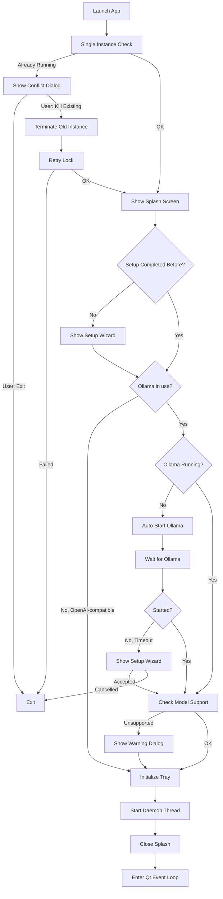
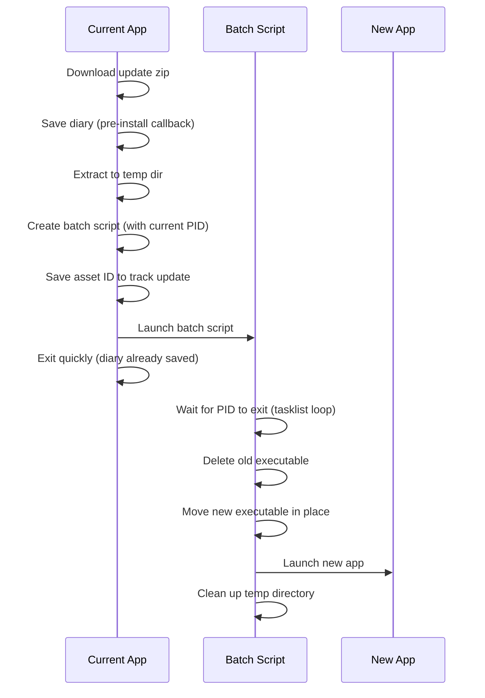

# Desktop App Specification

This document outlines the architecture and behavior of the Jarvis Desktop App - a cross-platform PyQt6 system tray application that provides a graphical interface for the Jarvis voice assistant.

## Overview

The desktop app is a **separate package** from the core `jarvis` module. It depends on `jarvis` for assistant functionality but `jarvis` has no knowledge of or dependency on the desktop app. This separation allows:

- Running Jarvis headless (CLI/daemon only)
- Building alternative UIs (web, mobile) without modifying core logic
- Keeping PyQt6 dependencies isolated from the core package

## Package Structure

```
src/desktop_app/
├── __init__.py          # Package exports, main() entry point
├── app.py               # JarvisSystemTray, windows, startup flow
├── splash_screen.py     # Animated startup splash
├── setup_wizard.py      # First-run setup wizard
├── settings_window.py   # Auto-generated settings UI from config metadata
├── face_widget.py       # Animated face visualization
├── themes.py            # Qt stylesheets and color palette
├── diary_dialog.py      # End-of-session diary update dialog
├── chat_window.py       # Text chat interface (see chat_window.spec.md)
├── memory_viewer.py     # Flask-based memory browser
├── updater.py           # Update checking logic
├── update_dialog.py     # Update notification dialogs
└── desktop_assets/      # Icons and images
```

## Startup Flow

The startup sequence ensures a smooth user experience even when dependencies (like Ollama) aren't ready.


```mermaid
flowchart TD
    A[Launch App] --> B[Single Instance Check]
    B -->|Already Running| B2[Show Conflict Dialog]
    B2 -->|User: Exit| Z[Exit]
    B2 -->|User: Kill Existing| B3[Terminate Old Instance]
    B3 --> B4[Retry Lock]
    B4 -->|Failed| Z
    B4 -->|OK| C
    B -->|OK| C[Show Splash Screen]
    C --> D{Setup Completed Before?}
    D -->|No| E[Show Setup Wizard]
    D -->|Yes| PR{Ollama in use?}
    E --> PR
    PR -->|No, OpenAI-compatible| M[Initialize Tray]
    PR -->|Yes| F{Ollama Running?}
    F -->|No| G[Auto-Start Ollama]
    G --> H[Wait for Ollama]
    H --> I{Started?}
    I -->|No, Timeout| W[Show Setup Wizard]
    W -->|Accepted| K[Check Model Support]
    W -->|Cancelled| Z[Exit]
    I -->|Yes| K[Check Model Support]
    F -->|Yes| K
    K -->|Unsupported| L[Show Warning Dialog]
    K -->|OK| M[Initialize Tray]
    L --> M
    M --> N[Start Daemon Thread]
    N --> O[Close Splash]
    O --> P[Enter Qt Event Loop]
```

### Key Startup Features

1. **Splash Screen**: Shows immediately to provide visual feedback while loading. It stays hidden throughout the unreachable-server warning and any setup wizard opened from that warning, then resumes when startup continues (whether the wizard is accepted or cancelled).
2. **Provider-aware Ollama gating** (`_ollama_runtime_flags` in `app.py`): The Ollama server-start and model-verification steps run only when a local provider actually uses Ollama. A pure OpenAI-compatible setup (chat and embeddings both remote) skips them entirely. `get_required_models()` is provider-aware, so model verification pulls exactly the models that run locally: chat + intent-judge when chat is on Ollama, and the embedding model when embeddings are on Ollama. When chat is on Ollama, a missing model opens the setup wizard; when only embeddings are local (remote chat), a missing embedding model surfaces a clear non-blocking instruction (memory search falls back to keyword matching until it is pulled). The unsupported-chat-model check runs only on the Ollama chat path. `should_show_setup_wizard()` returns False for an OpenAI-compatible chat provider.
3. **Ollama Auto-Start**: When Ollama is in use and not running, automatically starts it (up to 15s wait). If the wait times out, the setup wizard opens so the user can diagnose connectivity; cancelling the wizard exits the app. The desktop app records ownership only for an Ollama runtime it launches in this session. On app exit, it stops that owned runtime and leaves any pre-existing user-managed Ollama process running.
3a. **OpenAI-compatible reachability check** (`_check_openai_compat_reachable` in `app.py`): Jarvis cannot start a third-party server the way it starts Ollama, so on a pure OpenAI-compatible setup it checks the server answers `GET /v1/models` and, if not, shows a one-off warning naming the address (never the API key) and pointing to Settings, then continues. The user only otherwise discovers a down server when their first request fails.
4. **Single Instance Lock**: Prevents multiple copies from running simultaneously. If another instance is detected, shows a dialog offering to close the existing instance and start fresh.
5. **Crash Detection**: Detects previous crashes and offers to submit bug reports

### CLI Flags

| Flag | Purpose |
|------|---------|
| `--smoke-test` | CI smoke-test mode. Creates a minimal offscreen QApplication, runs the daemon initialisation (`daemon.main(smoke_test=True)`), prints `SMOKE_TEST_PASSED` on success (or the error + traceback on failure), and exits with code 0 or 1. Forces UTF-8 stdout/stderr on every OS (emoji-safe even when the console is an ANSI code page or absent) and Qt's offscreen platform on Linux so the gate never depends on xvfb/xcb. Bypasses the single-instance lock, crash detection, splash screen, setup wizard, Ollama checks, model verification, tray icon, and event loop. Used by the `release-smoke.yml` workflow to verify the bundled binary starts without missing DLLs or broken imports before fast-forwarding `main` to `develop`. |

## Main Components

### JarvisSystemTray

The central controller that manages:

- **System tray icon** with context menu
- **Daemon lifecycle** (start/stop the Jarvis voice assistant)
- **Voice pause**: Pause Voice Listening / Resume Voice Listening controls
  assistant capture without stopping the daemon, models, MCP sessions, text
  chat or intentional dictation. Turn Off shuts down the assistant. The
  assistant power action reads Turn On while stopped and Turn Off while running.
- **Window management** (log viewer, memory viewer, face window)
- **Update checking** on startup and on-demand
- **Runtime diagnostics** (`🩺 Runtime Status`): shows whether the assistant is listening, the daemon mode/PID, whether Low Power Mode is active, whether Ollama is needed/running, whether Jarvis owns the current Ollama runtime, active chat/embedding models, and configured MCP server count. The dialog is informational and never starts or stops services.

### Windows

| Window | Purpose |
|--------|---------|
| **LogViewerWindow** | Real-time log output from the daemon, with "Report Issue" button |
| **MemoryViewerWindow** | Web-based memory browser (Flask server) |
| **FaceWindow** | Animated face that reacts to speaking state |
| **SettingsWindow** | Auto-generated config editor with tabbed categories |
| **SetupWizard** | First-run configuration (Ollama, models, profile) |
| **DictationHistoryWindow** | Scrollable list of past dictations with copy/delete/clear actions |
| **ChatWindow** | Text chat interface alongside voice; shares one conversation with the voice path and is enabled only while the daemon is running (see `chat_window.spec.md`) |

### Activity log and downloads

- The log viewer uses a timestamped timeline with distinct success, warning and error colours from the shared theme. Messages are inserted as plain text, including tracebacks.
- Download updates appear in a live card above the timeline, showing the filename, percentage, transferred/total bytes, speed and remaining time when supplied by the downloader. Unknown totals use an indeterminate bar, never a fabricated percentage.
- Repeated updates are coalesced; the timeline retains download start/completion events and all ordinary messages. Completion of a small metadata file must not hide another active model download.
- The progress card is visible only while work is active: it hides when the last download completes, when MLX Whisper reports readiness, or when the listener announces listening. Completion remains in the timeline. A subsequent download or preparation stage shows the card again; repeated final updates do not leave a permanent 100% card.
- After 15 seconds without a transfer update, the card states how long it has been waiting. It does not invent byte progress. Model loading/warmup is a separate indeterminate stage, followed by readiness or an error.
- Both bundled output capture and subprocess output support carriage-return progress and strip terminal control sequences. The desktop sets `TQDM_POSITION=-1` before loading dependencies so Hugging Face emits byte progress to non-terminal output, respecting explicit user environment overrides.
- Clear resets both the timeline and download state. Report Issue includes the visible progress snapshot and applies the existing redaction rules to it.
- Missing optional location support is reported once at startup with a pointer to Setup, without printing the full installation guide.
- Missing optional location support is a warning, rendered in yellow because it degrades available functionality.

Window visibility is user-controlled: starting or stopping the assistant never shows or hides the log viewer or the face window. The windows open automatically once at app launch; after that the tray menu's `📝 View Logs` and `👤 Show Face` actions open them, while window close controls and the face's `Hide face` menu can hide them (the diary dialog shown while stopping is raised on top but leaves those windows' visibility untouched).

### Desktop face presence

The face is a compact frameless, translucent tool window, always on top without
accepting focus or activating when shown. macOS keeps the tool window visible
when another application is active. It paints an angular amber mask made from
straight connected light beams, small illuminated junctions, diamond eyes,
cheek accents and a straight mouth seam. Slow paired energy highlights travel
around the fixed beams on a twelve-second cycle, with greater intensity during
processing. Fine amber strokes and fixed glowing junctions define the mask,
with a narrow ink outline for contrast on light backgrounds. The mask is 70%
of the design width and 1.3 times as tall as it is wide. Diamond eyes sit 15%
of its height above the centre, and the mouth spans 70% of its width at 25%
of its height below the centre. Pupils are flat amber lights. There is
no background panel, grid, title bar, subtitle area or persistent toolbar.
Eyes paint only their outlines and small lit pupils, with transparent
interiors and surroundings. Contrast and glow follow those strokes; there is
no filled eye halo to obscure desktop content.

The default footprint is 220 × 280 logical pixels, with zero layout margins.
Vector strokes, glows and motion scale together with the face geometry.
Presence opacity and state-entry animations follow the same frame-level state
observation for bundled signals and file-backed subprocess updates.
Asleep and idle states have lower window opacity than active listening,
thinking, speaking or dictation. The native input region follows the face's
contour with enough padding for breathing and active cues. Empty corners and
lateral margins pass clicks through to the desktop.
Dragging the face uses native window movement where supported, with a pointer
position fallback. A right-click menu hides the face; the tray shows it again
without activating it. Visibility remains user-controlled after launch.

The face's character comes from restrained expressions and uninterrupted
negative space. Awake breathing changes its size by at most 0.6%, without
moving or tilting the window. Natural brief blinks occur 4.5 to 7.5 seconds
apart. Idle glances last 3.2 seconds, stay within 2.5 logical pixels horizontally
and one vertically, and are separated by 9 to 15 seconds of rest. The face
does not track the pointer or analyse the desktop.

- **Asleep:** straight closed eye beams and a still, dim silhouette after settling.
- **Idle:** soft breathing, a straight mask seam and occasional blinks and glances.
- **Listening:** receptive eyes and a close-fitting amber echo on a two-second cycle.
- **Thinking:** pupils look gently upwards while the flowing beam highlights intensify.
- **Speaking:** the mouth seam opens into a small, smoothly tapered waveform. It indicates
  the speaking state without measuring or recording audio.
- **Dictation:** a close-fitting coral outline breathes during recording; processing
  combines that outline with the thinking expression.

Animation follows monotonic elapsed time, with smooth activation and state
blends independent of frame rate. Each frame does a bounded amount of work,
including after a long event-loop stall. Hidden faces stop their animation
timer and observe the latest state immediately when shown. Visible resting
faces use a lower refresh rate, with a 250 ms state check when fully asleep.
`scripts/capture_face_preview.py` renders the actual widget on light and dark
backgrounds using isolated in-memory state and a fixed clock.

**Face state follows the daemon lifecycle**: the face animates from states written by the daemon (`JarvisStateManager`, file-backed for cross-process use). Whenever the daemon goes down — the tray's Turn Off / Turn On control, an unexpected exit, or the setup wizard pausing it — the tray resets the face to `ASLEEP` so it never looks awake while no daemon is running. Starting the daemon lets the daemon's own state writes take over again.

### Face context menu

Right-clicking the face opens a themed, opaque menu with a Hide Face action
and every tray action, in tray order with the same separators. The actions are
shared with the tray, so status labels, enabled states, callbacks and
platform-specific recovery controls stay consistent while either menu is open.
The popup uses the desktop's dark surface, amber selection and muted disabled
items. Long menus scroll in one column within the available screen instead of
spreading into clipped columns. The face retains its transparent background and non-activating presence.

### Rejected speech

Low-confidence transcription is a listener diagnostic, not evidence of an
addressed user request. It does not produce face text, reserve subtitle space,
change face state, raise the window or trigger TTS. The face contains only its
animation; rejected segments remain filtered and logged by the listener.

### macOS tray event safety

The desktop installs a guard on Qt Cocoa tray activation callbacks after creating `QApplication` and before showing a tray icon. Non-mouse and missing AppKit events do not reach Qt's `clickCount` access. Ordinary mouse events retain the native activation reason and menu handling. Native implementation pointers are captured before replacement so repeated installation cannot recursively call the guard. The guard affects only Qt's tray delegate within the desktop process; it does not modify AppKit event classes, capture keyboard input, or post system events. If native guard installation is unavailable, the desktop records a diagnostic.

### Tray Menu: GPU Library Recovery (Windows)

`cuda_recovery.py` exposes the `🎮 Reinstall GPU libraries` action. The tray adds it only when running on Windows, an NVIDIA driver is detected (`%SystemRoot%\System32\nvcuda.dll` exists), and the bundled `install_cuda.ps1` script is on disk. Clicking it confirms with the user, then re-runs `install_cuda.ps1` via `ShellExecuteW` with the `runas` verb so UAC elevates the process before it writes into `Program Files\Jarvis\cuda`. This is the only user-facing recovery path when the original Inno Setup install of cuBLAS/cuDNN fails — the installer's own task fires once per install and the script's marker file used to make subsequent reinstalls skip the CUDA step. The runtime probe in `jarvis.listening.listener._print_cuda_unavailable_hint` points users at this action by name when it falls back to CPU.

The Inno Setup script also runs a `VerifyCudaInstall` hook after the CUDA download task completes. The hook checks for the `.cuda_installed` marker (which `install_cuda.ps1` only writes after every expected DLL is present and SHA-verified) and surfaces a `MsgBox` pointing at `{app}\cuda\install.log` and the tray recovery action when the marker is missing. This is what makes a hidden install failure visible to the user instead of letting the installer report success on a half-installed CUDA tree.

### DictationHistoryWindow Behaviour

- **Backing store**: File-backed via `DictationHistory` (`src/jarvis/dictation/history.py`); entries are newest-first with `id`, `text`, `timestamp`, `duration`. Disk is the source of truth — the window must not assume its in-memory instance is authoritative.
- **Hidden windows are inert**: Signals from the dictation engine must not mutate the widget tree while the window is hidden; pending entries are surfaced on next open instead. The engine persists entries regardless, so no data is lost.
- **On show, reload from disk and rebuild**: The window reads disk state on every show, because the daemon may be in a separate process (subprocess mode) or may have recorded entries while the window was hidden (bundled mode). In-memory state alone is not trusted.
- **While visible, poll for external writes**: A short interval timer watches the history file's mtime and reloads on change so subprocess-mode dictations appear without requiring a re-open.
- **Rebuilds replace the container**: `_reload()` builds a fresh list container and installs it into the scroll area via `takeWidget()` + `setWidget()`; the previous container is hidden and `deleteLater()`'d. This atomic swap sidesteps every class of orphan-during-paint issue that surgical layout edits invite.
- **Reload deferred off showEvent**: `showEvent` schedules the rebuild via `QTimer.singleShot(0, ...)` rather than mutating the widget tree inline, so the first paint pass sees a stable tree.
- **No emoji codepoints in `strftime` format strings**: On Windows with the bundled Python 3.11, `datetime.strftime` routes through the C locale encoder and raises `UnicodeEncodeError` on non-BMP codepoints (e.g. 📅). When that exception escapes a Qt slot invocation, Qt6Core triggers a fast-fail (0xc0000409) and the whole app dies. Build timestamp labels by interpolating emoji outside `strftime`.

### LogViewerWindow Features

- Real-time log streaming from daemon
- Monospace font for readability (JetBrains Mono on macOS, Consolas elsewhere)
- **Report Issue button**: Opens a local composer asking what happened and, optionally, what should have happened. A short summary and reproduction steps live behind an optional extra-details control. The first description line supplies the issue title unless the user supplies a summary. Whitespace-only descriptions keep review disabled.
- A separate review step presents the description as readable text, without Markdown or configuration jargon. Troubleshooting details start collapsed and can be inspected or excluded together. Back preserves entered details. Copy and browser actions are available only after advancing to review. Nothing is submitted automatically.
- Known secrets and email addresses are scrubbed across all fields, metadata and logs. User text is escaped before rich rendering, so it cannot introduce HTML, images or links. Troubleshooting details can still contain conversation text, which the review explains.
- Reports include a readable version/channel. Optional troubleshooting details include OS/architecture, a whitelist of configured provider, chat model and Whisper choices, and current download progress. Credentials, endpoint fields and the complete configuration are not included. Configured choices are not presented as observed runtime readiness. Logs retain bounded truncation preserving startup, fatal diagnostics and recent activity.
- Short reports open a pre-filled GitHub issue. Reports whose encoded browser link exceeds 8,000 characters explicitly offer to copy the prepared report and open GitHub for the user to paste it. Copying and browser transport use the same redacted report content represented by the review and optional troubleshooting panel. A browser failure keeps the composer and its contents open with copy guidance.
- Both pages have scroll viewports retaining usable field and preview sizes when extra details are revealed; navigation remains outside the scrolling area.

### Splash Screen

Animated loading screen shown during startup with:

- Pulsing orb animation (matches theme colors)
- Status text updates ("Checking Ollama...", "Starting daemon...")
- Frameless, centered, always-on-top

## Daemon Integration

The desktop app runs the Jarvis daemon in a **QThread** (bundled mode) or **subprocess** (development mode).

```
┌─────────────────────────────────────────┐
│           Desktop App (Main Thread)      │
│  ┌─────────────────────────────────┐    │
│  │         Qt Event Loop            │    │
│  │  - Tray icon interactions        │    │
│  │  - Window management             │    │
│  │  - Signal/slot communication     │    │
│  └─────────────────────────────────┘    │
│                   │                      │
│                   │ signals              │
│                   ▼                      │
│  ┌─────────────────────────────────┐    │
│  │      DaemonThread (QThread)      │    │
│  │  - Runs jarvis.daemon.main()     │    │
│  │  - Captures stdout/stderr        │    │
│  │  - Emits logs to LogViewer       │    │
│  └─────────────────────────────────┘    │
└─────────────────────────────────────────┘
```

### Threading: worker QThreads never die while running

All long-lived worker QThreads in the desktop app inherit `KeepAliveWorker`
(`src/desktop_app/qt_worker.py`): `DaemonThread`, `SetupCheckWorker`,
`_LLMReachWorker`, `ServerCheckWorker` (app.py) and every setup-wizard
worker. The class keeps each started worker referenced in a class-level
registry until its OS thread has fully finished (released via the built-in
`finished` signal). Dropping the last Python reference to a winding-down
QThread — for example from a completion slot that clears the attribute
holding it — destroys a running QThread and Qt aborts the whole app with
"Fatal Python error: Aborted" on the main thread (#584/#575/#576; the
setup-wizard crash class #509/#407/#239). Because of this, worker
subclasses must never shadow the built-in `finished` signal — custom
completion signals use other names (`check_done`, `completed`, `done`).

`DaemonThread`'s `finished` slot (`_on_daemon_finished`) is connected with
`Qt.QueuedConnection`: the signal is emitted from the worker's OS thread,
and the slot mutates Qt UI state (menu actions, tray icon, face state), so
it must run on the main thread.

### Daemon ownership and shutdown

Starting is blocked while an owned thread or subprocess is alive, or while
Stop is processing Qt events. The core daemon also holds a per-user OS lock
across initialisation and cleanup (see `src/jarvis/daemon_lock.spec.md`).

A bundled shutdown that exhausts its wait retains the worker handle and
blocks replacement until that worker finishes. Its completion callback is
queued on the GUI thread and identifies the originating worker. A delayed
callback cannot reset a replacement daemon's UI or drop its handle. Stop
uses its captured worker reference while processing events; completion can
safely retire the tray's reference. Re-entrant Stop requests return without
starting another shutdown. The status timer also retires finished workers,
including those whose shutdown timed out.

### Daemon Callbacks

The desktop app registers callbacks with the daemon for:

- **Diary updates**: Shows DiaryUpdateDialog when session ends
- **Clean shutdown**: Ensures graceful exit with diary save

#### Bundled Mode (QThread)

In bundled mode, the daemon runs in the same process, so callbacks can be set directly via `set_diary_update_callbacks()`. The DiaryUpdateDialog receives:
- `on_chunks`: List of conversation chunks being summarized
- `on_token`: Streaming tokens as the diary is generated
- `on_status`: Status messages ("Writing diary entry...")
- `on_complete`: Completion signal (success/failure)

#### Subprocess Mode (Development)

In subprocess mode, the daemon runs as a separate process. IPC is achieved via stdout:
- **Diary updates**: Daemon emits JSON events prefixed with `__DIARY__:` (e.g., `__DIARY__:{"type":"token","data":"Hello"}`)
- **Chat events**: Daemon emits `__CHAT__:` events (start/complete/busy); the desktop app sends queries in via `__CHAT_QUERY__:` lines on the daemon's stdin, cancellation via a bare `__CHAT_CANCEL__` line, and rewind via `__CHAT_REWIND__:` lines (see `chat_window.spec.md`)
- Desktop app intercepts these lines from the log stream
- DiaryUpdateDialog's `process_log_line()` parses and emits signals
- Chat IPC lines are marshalled onto the Qt main thread via `ChatIpcSignals`, then `_on_chat_ipc_line()` forwards them to `ChatWindow.process_ipc_line()`
- When the daemon starts, stops, or a subprocess exits unexpectedly, the tray updates any open ChatWindow lifecycle banner and clears or refreshes its subprocess stdin submit function so the window never writes to a dead pipe.
- Same UI experience as bundled mode

Voice pause uses the core `set_voice_listening_paused` API in bundled mode.
Subprocess mode sends `__VOICE_PAUSE__:` JSON with a Boolean `paused` and unique
`request_id`; the daemon returns `__VOICE_STATUS__:` status data carrying the
same identity, availability and applied user-pause state. These protocol lines
are hidden from the activity log and marshalled onto the Qt main thread.
The tray changes its paused/resumed status only after a matching valid
acknowledgement. Pending requests disable the action. After ten seconds without
confirmation, or a broken pipe/unavailable capture, it reports an unknown voice
state and permits a fresh pause attempt. Late identities and events from another
daemon process cannot affect the current runtime. Shutdown disables the action;
a replacement daemon begins with unpaused capture. Pause is runtime state and is
not saved to configuration. The hardware capture stream remains warm while
assistant input is discarded; this control does not claim to release the device.

## Theme System

All UI components use a consistent dark theme defined in `themes.py`:

```python
COLORS = {
    "bg_primary": "#09090b",      # Deep space black
    "bg_secondary": "#18181b",    # Slightly lighter
    "accent_primary": "#f59e0b",  # Amber
    "accent_secondary": "#fbbf24", # Lighter amber
    "text_primary": "#fafafa",    # White
    "text_secondary": "#a1a1aa",  # Muted
    ...
}
```

Components use `JARVIS_THEME_STYLESHEET` for consistent styling across all dialogs and windows.

## Update System

The desktop app includes an auto-update mechanism:

1. **Check**: Queries GitHub releases API for newer versions
2. **Notify**: Shows dialog with changelog and download option
3. **Download**: Downloads new installer with progress bar
4. **Install**: Platform-specific installation (see below)

Updates are only available in bundled mode (PyInstaller builds).

### Platform-Specific Update Installation

| Platform | Strategy |
|----------|----------|
| **macOS** | Extracts the update zip with `ditto -x -k` (Python's `zipfile` drops the symlinks Qt/Qt WebEngine frameworks rely on, producing a bundle macOS refuses to launch with "Jarvis.app can't be opened"; the release workflow creates the zip with the matching `ditto -c -k --keepParent`). Falls back to `zipfile.extractall` only when `/usr/bin/ditto` is missing — i.e. unit tests on Linux CI; production macOS always ships ditto, so the fallback never runs in the field. Then creates a shell script that waits for the current process (by PID via `kill -0`) to exit, moves the old `.app` aside to `Jarvis.app.backup` (one-generation rollback), moves the new bundle in, strips `com.apple.quarantine` so Gatekeeper doesn't re-prompt on unsigned builds, re-registers the swapped bundle with `lsregister -f` (LaunchServices caches the old inode across the `mv` and a bare `open` silently no-ops otherwise), relaunches with `open -n`, and falls back to execing the bundle's inner binary via `nohup` if `open` fails. Script output is captured to `~/Library/Logs/Jarvis/updater.log` (size-capped) so detached failures leave a diagnostic trail. The executable name is read from the new bundle's `CFBundleExecutable`, not hardcoded. No Finder/AppleScript automation. Pattern mirrors Squirrel.Mac's `ShipIt` helper. |
| **Windows** | Creates a batch script that waits for the current process (by PID via `tasklist`) to exit, then runs the Inno Setup installer with `/SILENT` so the installer's own progress window provides visual feedback during install, then relaunches the upgraded exe. Rollback is handled by Inno Setup's own in-session rollback + retained uninstaller data. |
| **Linux** | Creates a shell script that waits for the current process (by PID via `kill -0`) to exit, moves the old directory to `Jarvis.backup` for rollback, moves the new directory in, and relaunches |

### Update Flow (Windows/Linux)


```mermaid
sequenceDiagram
    participant App as Current App
    participant Batch as Batch Script
    participant New as New App

    App->>App: Download update zip
    App->>App: Save diary (pre-install callback)
    App->>App: Extract to temp dir
    App->>App: Create batch script (with current PID)
    App->>App: Save asset ID to track update
    App->>Batch: Launch batch script
    App->>App: Exit quickly (diary already saved)
    Batch->>Batch: Wait for PID to exit (tasklist loop)
    Batch->>Batch: Delete old executable
    Batch->>Batch: Move new executable in place
    Batch->>New: Launch new app
    Batch->>Batch: Clean up temp directory
```

### Important Notes

- **Diary is saved before update installation**: The `pre_install_callback` mechanism ensures the diary is saved before the update process begins, so no data is lost
- **Commit-based detection (develop)**: For develop channel updates (where the release version stays "latest"), the installed build's commit — stamped as `dev-<sha>` in `_version.py` by CI (`dev-<full sha>`) or `scripts/build_installer.*` (`dev-<7-hex sha>`) — is compared against the commit the latest release was built from (`**Commit**: <sha>` in the release body, added by `release.yml`). Only a mismatched commit shows the update prompt, so a fresh install from the release page or a CI re-upload of the same commit no longer triggers it. When either side can't be determined (e.g. a `dev-local` source run, or a release published without the commit stamp), the updater falls back to tracking the GitHub asset ID
- **Robust Windows update**: The batch script waits for the actual process to exit (by PID) rather than using a fixed timeout, ensuring the update doesn't fail due to slow shutdown
- **Visible Windows install progress**: The Inno Setup installer runs with `/SILENT` (not `/VERYSILENT`) so its own progress window is visible while the install runs — bridging the gap between the download dialog closing and the new app launching, which would otherwise look like a hang
- **Quarantine stripping (macOS)**: The shell script runs `xattr -dr com.apple.quarantine` on the newly-installed bundle. Builds are unsigned (ad-hoc signing breaks Qt WebEngine's symlinks — see `release.yml`), so without this step Gatekeeper may re-trigger the "unidentified developer" prompt on every update
- **One-generation rollback (macOS, Linux)**: The previous `.app` / directory is moved aside to `<name>.backup` rather than deleted outright, so a user can restore the prior version manually if the new one fails to launch. The backup from the previous update is cleared before creating a new one, so at most one backup exists on disk at a time. This is a simplified version of Squirrel's versioned-folder rollback — enough safety for a single-bundle install, without the architectural overhead

## Memory Viewer

A Flask-based web interface for browsing conversation history:

- Runs on `localhost:5050`
- **Bundled mode**: Flask runs in a daemon thread
- **Development mode**: Flask runs as subprocess
- Opens in embedded QWebEngineView or system browser (macOS fallback)

## Error Handling

### Crash Detection

1. On startup, creates a `.crash_marker` file
2. On clean exit, removes the marker
3. On next startup, if marker exists → previous session crashed
4. Offers to submit crash report to GitHub Issues

### Crash Reports Carry the Native Stack (macOS)

"Fatal Python error: Aborted" crashes are C-level aborts whose native
stack faulthandler cannot capture — it only dumps Python frames, which for
the abort family (#584/#575/#576) shows nothing but the main thread parked
in `app.exec()`. On macOS the OS still writes a full report with native
frames to `~/Library/Logs/DiagnosticReports/Jarvis-*.ips`. On the next
launch, `collect_macos_crash_report()` finds the newest report newer than
the previous crash log and appends its exception type, termination
indicator and the crashed thread's top native frames to the crash-dialog
content and the report-issue body, so these aborts become diagnosable.

### Fallbacks

- **No Ollama**: Shows setup wizard or auto-starts
- **No WebEngine**: Opens memory viewer in system browser
- **Model not supported**: Warning dialog with option to change
- **Update failed**: Error dialog with details

## Platform-Specific Behavior

| Feature | macOS | Windows | Linux |
|---------|-------|---------|-------|
| Tray icon | Native menu bar | System tray | System tray |
| Ollama start | `open -a Ollama` | `ollama serve` (hidden) | `ollama serve` |
| Crash logs | `~/Library/Logs/Jarvis` | `%LOCALAPPDATA%\Jarvis` | `~/.jarvis` |
| Memory viewer | System browser* | Embedded WebEngine | Embedded WebEngine |

*macOS bundled apps use system browser due to QtWebEngine sandbox issues.

## File Locations

| File | macOS | Windows | Linux |
|------|-------|---------|-------|
| Config | `~/.config/jarvis/` | `%APPDATA%\jarvis\` | `~/.config/jarvis/` |
| Database | `~/.local/share/jarvis/` | `%LOCALAPPDATA%\jarvis\` | `~/.local/share/jarvis/` |
| Crash logs | `~/Library/Logs/Jarvis/` | `%LOCALAPPDATA%\Jarvis\` | `~/.jarvis/` |
| Instance lock | `~/Library/Application Support/Jarvis/` | `%LOCALAPPDATA%\Jarvis\` | `~/.jarvis/` |

## Apple Silicon speech packaging

- macOS arm64 desktop builds include the MLX Whisper backend, its tokeniser/audio assets, native MLX libraries and `mlx/lib/mlx.metallib`. SciPy remains available for word alignment.
- The MLX namespace is collected explicitly rather than recursively, and the optional PyTorch Whisper implementation is excluded from collection. Numba uses the PyInstaller dependency hook.
- A missing Metal shader library stops the arm64 build. Intel Mac, Windows and Linux builds do not collect the Apple backend.
