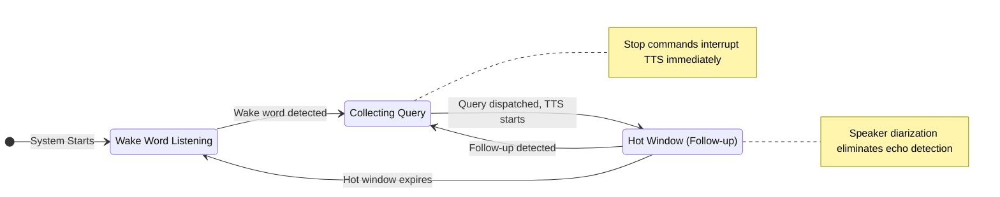

# Listening Flow Specification

This document outlines the voice listening flow using streaming transcription with speaker diarization.

## Core Architecture

The listening system uses **WhisperLiveKit** with **speaker diarization** for real-time voice processing.

### Key Features

- **🎯 Speaker-based Processing:** Each transcript includes a speaker ID for reliable command detection
- **⚡ Real-time Transcription:** Streaming results provide immediate feedback for stop commands
- **🚀 Direct Command Processing:** Stop commands, wake words, and queries are processed immediately
- **🎙️ Audio Device Selection:** Support for specific microphone selection

## The Two Listening States

### 1. Wake Word Listening (Default)

The system's baseline state.

-   **Behavior:** Continuously processes streaming transcription results
-   **Action:** When wake word detected from any speaker, begin collecting query
-   **Simplification:** No complex timing or energy analysis needed

### 2. Active Conversation Mode

Activated after wake word detection or during hot window.

-   **Collection:** Accumulate speech from the same speaker until pause
-   **Hot Window:** Brief period after TTS completion for follow-up questions
-   **Stop Commands:** Immediate TTS interruption when detected from any speaker
-   **Simplification:** Speaker ID eliminates need for echo detection

## State Transition Diagram

## Processing Logic

When a streaming transcript is received with speaker ID:

1.  **Stop Command Check:** If TTS is speaking and transcript contains stop command → interrupt TTS
2.  **Collection Mode:** If actively collecting → add to current query
3.  **Hot Window:** If in hot window → start new collection
4.  **Wake Word:** If contains wake word → start new collection
5.  **Ignore:** Otherwise ignore (not in active listening state)

## Configuration

**Essential Settings:**
- ✅ `voice_device` - Audio input device selection
- ✅ `wake_word` and `wake_aliases` - Wake word detection
- ✅ `stop_commands` - Stop command phrases
- ✅ `hot_window_seconds` - Follow-up conversation timeout
- ✅ WhisperLiveKit streaming settings - Model and backend configuration
- ✅ Speaker diarization settings - Real-time speaker identification
- ✅ MLX acceleration - Automatic detection on macOS ARM64 (no config needed)