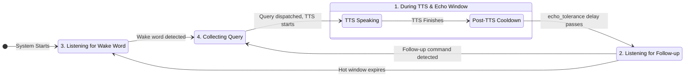

# Listening Flow Specification

This document outlines the high-level logic for the voice listening flow. The system operates primarily in three distinct states or "windows" to handle user input intelligently.

## The Three Listening Windows

The listening system can be understood as a state machine that transitions between three main windows.

### 1. During TTS & Echo Window (`TTS start` to `TTS end + echo_tolerance`)

This is the state for aggressive echo suppression to prevent the assistant from hearing itself.

-   **While TTS is speaking:** Any incoming audio is checked against a time-calculated *segment* of the TTS text. This is critical for allowing "stop" commands to be recognized as interruptions, not echo.
-   **Post-TTS Cooldown (`echo_tolerance`):** For a brief period after TTS finishes (e.g., 0.3s), any audio matching the full TTS text is checked against the ambient noise level measured just *before* the TTS began. Low-energy audio is rejected as echo, while high-energy audio is accepted as a quick user reply.
-   **Extended Cooldown:** For a slightly longer period (e.g., up to 1.5s), this handles delayed echoes caused by audio processing lag. In this slightly longer window, any audio that fully matches the last TTS text is rejected based on the text match alone (without an energy check). This is a stricter check to prevent the system from responding to its own delayed transcription.

### 2. Hot Window Mode

This window allows for natural, wake-word-free follow-up conversation.

-   **Activation:** Begins immediately after the "Echo Window" ends.
-   **Behavior:** Listens for a short duration (e.g., 6s) for any user speech.
-   **Action:** If speech is detected, the system transitions into **collection mode**, allowing the user to provide a full, multi-part response. Any leading text that overlaps with the end of the previous TTS is removed to clean up the query.
-   **Termination:** The hot window state ends as soon as collection begins. The collection itself will then timeout normally after a pause from the user.

### 3. Wake Word Listening (Default)

This is the system's baseline state.

-   The system is passively listening only for the "wake word" (e.g., "Jarvis").
-   All other audio is ignored.
-   Upon detecting the wake word, the system begins collecting the user's full query.

## State Transition Diagram

This diagram illustrates the flow between the three primary listening windows.

## Processing Priorities

When transcribed text is received, it's processed in a strict order of priority:

1.  **Echo Check:** Is the audio an echo of the TTS? This is a multi-step check:
    *   If during TTS, check against a *segment* of the TTS text.
    *   If in the post-TTS cooldown, check against the *full* text with an energy comparison.
    *   If in the extended cooldown, check against the *full* text with a stricter text-only match.
2.  **Stop Command Check:** Is it a stop command during TTS? If so, interrupt TTS.
3.  **Hot Window Check:** Was the user speaking during an active hot window? If so, clean up any leading echo and start collecting their full query.
4.  **Wake Word Check:** Does the audio contain the wake word? If so, start collecting a new query.
5.  **Ignore:** If none of the above, ignore the audio.
