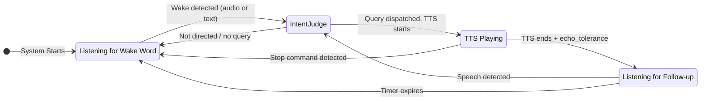

# Listening Flow Specification v2

This document outlines the voice listening architecture. The system uses a **transcript-first** approach where speech is continuously transcribed, and an LLM intent judge extracts queries with full context.

## Architecture Overview

```
┌─────────────────────────────────────────────────────────────────┐
│                         Audio Stream                            │
└───────────────────────────┬─────────────────────────────────────┘
                            │
            ┌───────────────┼───────────────┐
            ▼               ▼               ▼
┌───────────────┐  ┌───────────────┐  ┌───────────────┐
│     VAD       │  │  openWakeWord │  │   TTS Output  │
│ (speech gate) │  │ ("hey jarvis")│  │   Tracking    │
└───────┬───────┘  └───────┬───────┘  └───────────────┘
        │                  │
        ▼                  │
┌───────────────┐          │
│    Whisper    │          │
│ (transcribe)  │          │
└───────┬───────┘          │
        │                  │
        ▼                  ▼
┌───────────────────────────────────────┐
│     Rolling Transcript Buffer         │
│     (5 minutes, with timestamps)      │
│                                       │
│  Segments include:                    │
│  - text, start_time, end_time         │
│  - energy level                       │
│  - is_during_tts flag                 │
└───────────────────┬───────────────────┘
                    │
                    ▼ (on wake detection)
┌───────────────────────────────────────┐
│          Intent Judge LLM             │
│        (llama3.2:3b or main)          │
│                                       │
│  Inputs:                              │
│  - Transcript buffer (recent)         │
│  - Wake word timestamp (if any)       │
│  - Last TTS text + finish time        │
│  - Current state                      │
│                                       │
│  Outputs:                             │
│  - directed: bool                     │
│  - query: "extracted clean query"     │
│  - stop: bool                         │
│  - confidence: high/medium/low        │
│  - reasoning: "brief explanation"     │
└───────────────────┬───────────────────┘
                    │
                    ▼
┌───────────────────────────────────────┐
│           Reply Engine                │
└───────────────────────────────────────┘
```

## Key Design Principles

### 1. Transcript-First

Instead of extracting post-wake-word audio, we:
- Continuously transcribe all speech (VAD-gated)
- Store transcripts with timestamps in a rolling buffer
- Let the intent judge extract the relevant query

**Benefits:**
- Pre-wake-word chatter naturally filtered: "blah blah Jarvis what time is it" → "what time is it"
- Full context available for intent understanding
- Echo detection handled by smart LLM, not timing heuristics

### 2. Hybrid Wake Detection

Two parallel wake detection streams, first wins:

| Stream | Detects | Timing | Use Case |
|--------|---------|--------|----------|
| openWakeWord | "hey jarvis" | Audio-level, instant | Users who say "hey jarvis" |
| Text-based | "jarvis" + aliases | After transcription | Users who say just "jarvis" |

**Deduplication:** When openWakeWord fires, set a flag to skip text-based check for that utterance.

**Note:** openWakeWord is only enabled when `wake_word` config is "jarvis" (the only available model). For custom wake words, text-based detection is used exclusively.

### 3. Context-Aware Intent Judge

The intent judge receives full context and makes intelligent decisions:
- Knows what TTS said → can identify echo vs real speech
- Sees pre-wake-word context → can understand "...what do YOU think, Jarvis?"
- Extracts clean query → removes filler words, false starts

## The Three Listening Modes

### 1. Wake Word Mode (Default)

System is waiting for wake word activation.

**Triggers:**
- openWakeWord detects "hey jarvis" at audio level
- Text-based detection finds "jarvis" (or aliases) in transcript

**On trigger:**
1. Start "thinking" beep immediately
2. Wait briefly for utterance to complete (query may follow wake word)
3. Send transcript buffer + wake timestamp to intent judge
4. If `directed=true` and `query` exists, dispatch to reply engine

### 2. Hot Window Mode

After TTS finishes, allow wake-word-free follow-up.

**Activation:** `echo_tolerance` seconds after TTS ends (allows echo to settle)

**Duration:** Configurable (default: 3 seconds)

**Behavior:**
- Any speech triggers the intent judge (no wake word needed)
- Intent judge determines if speech is echo or real follow-up
- Judge has full context: TTS text, timing, transcript content

**Expiry:** Timer-based, guaranteed to fire even if no audio

### 3. During TTS

While TTS is playing, listen for stop commands only.

**Stop detection:**
- Text-based: Check for "stop", "quiet", "shut up", etc.
- Intent judge can also detect stop commands

**Echo handling:**
- Transcripts during TTS are flagged with `is_during_tts=true`
- Intent judge uses this context to identify echo

## Rolling Transcript Buffer

### Design

```python
@dataclass
class TranscriptSegment:
    text: str              # Transcribed text
    start_time: float      # Unix timestamp when speech started
    end_time: float        # Unix timestamp when speech ended
    energy: float          # Audio energy level
    is_during_tts: bool    # Whether TTS was playing during this segment

class TranscriptBuffer:
    max_duration_sec: float = 300.0  # 5 minutes, aligned with short-term memory
```

### Memory Alignment

The transcript buffer serves as the "live" portion of short-term memory:
- **Transcript buffer:** Last 5 minutes of raw speech (before processing)
- **Short-term memory:** Processed conversation turns (user queries + assistant responses)
- **Long-term memory (diary):** Summarized memories

### Methods

- `add(text, start_time, end_time, energy, is_during_tts)`: Add segment
- `get_since(timestamp)`: Get all segments since a timestamp
- `get_around(timestamp, before_sec, after_sec)`: Get segments in time window
- `format_for_llm(segments)`: Format for intent judge input
- `prune()`: Remove segments older than max_duration

## Intent Judge

### Context Duration

The intent judge receives transcript context based on model size:
- **Small models (1b/3b/7b):** 120 seconds (2 minutes)
- **Large models (8b+):** 300 seconds (5 minutes, full buffer)

This enables Jarvis to **chime into ongoing conversations** between people. When someone in a room asks "Jarvis, what do you think?", the judge has enough context to understand what they were discussing.

**Multi-person conversation example:**
```
[12:28:30] Person A: "I wonder what the weather will be like tomorrow"
[12:28:45] Person B: "Yeah, we should check before planning the picnic"
[12:29:00] Person A: "Jarvis, what do you think?"
```

With 2+ minutes of context, the intent judge understands "what do you think?" refers to the weather/picnic discussion and extracts an appropriate query.

Override with `intent_judge_context_seconds` in config if needed.

### Input Format

```
Transcript (context duration based on model size):
[12:28:30] "I wonder what the weather will be like tomorrow"
[12:28:45] "Yeah, we should check before planning the picnic"
[12:29:00] "Jarvis what do you think"

Wake word detected at: 12:29:00.5 (audio-level) OR 12:29:00.8 (text-based)
Last TTS: "The weather is sunny and 72 degrees"
TTS finished at: 12:28:02
Current state: wake_word_mode
```

### Output Format

```json
{
  "directed": true,
  "query": "what time is it",
  "stop": false,
  "confidence": "high",
  "reasoning": "Clear wake word followed by time question"
}
```

### Echo Handling by Judge

The intent judge handles echo detection intelligently:

1. **Content comparison:** Does transcript match TTS text?
2. **Timing:** Did segment occur shortly after TTS?
3. **Context:** Is this a natural follow-up or just echo?

Example:
```
TTS: "The weather is sunny and 72 degrees"
TTS finished: 12:30:14

Transcript:
[12:30:15] "The weather is sunny and 72 degrees" ← Echo (matches TTS, immediately after)
[12:30:18] "Ni hao" ← Real speech (different content)

Judge output: {"directed": true, "query": "Ni hao", "reasoning": "First segment is echo, second is new speech"}
```

## Configuration

```json
{
  "audio_wake_enabled": true,
  "audio_wake_threshold": 0.5,

  "transcript_buffer_duration_sec": 300,

  "intent_judge_model": "llama3.2:3b",
  "intent_judge_timeout_sec": 3.0,
  "intent_judge_context_seconds": null,

  "hot_window_seconds": 3.0,
  "echo_tolerance": 0.3
}
```

| Setting | Default | Description |
|---------|---------|-------------|
| `intent_judge_context_seconds` | `null` (auto) | Transcript context sent to intent judge. When null, auto-detects: 120s for small models (1b/3b/7b), 300s for large models (8b+). |
| `transcript_buffer_duration_sec` | 300 | Total buffer retention (5 min). Must be >= `intent_judge_context_seconds`. |

Note: Intent judge is always used when available (no enable flag). Falls back to simple wake word detection when Ollama is unavailable.

## State Transitions



## Audio Pipeline

```
Microphone Audio
    ↓
Sounddevice Callback → _audio_q
    ↓
    ├→ openWakeWord (parallel, audio-level "hey jarvis")
    ↓
Main Loop: Get Frames → VAD Check
    ↓
Speech Detected → Accumulate Frames
    ↓
Silence Timeout → Whisper Transcription
    ↓
Add to Transcript Buffer (with timestamps)
    ↓
Wake Detection Check:
    ├→ openWakeWord already fired? → Use that timestamp
    └→ Text contains "jarvis"? → Use utterance timestamp
    ↓
If wake detected OR in hot window:
    → Send buffer + context to Intent Judge
    ↓
If judge.directed and judge.query:
    → Dispatch query to Reply Engine
```

## Fallback Behavior

When components are unavailable, the system degrades gracefully:

| Component | Unavailable Behavior |
|-----------|---------------------|
| openWakeWord | Text-based wake detection only |
| Intent Judge | Simple text-based wake word + query extraction |
| Transcript Buffer | Process each utterance independently (current behavior) |

## Future: Acoustic Echo Cancellation

Currently, echo is handled at the transcript level by the intent judge. True acoustic echo cancellation (AEC) would:
- Require the audio output signal (reference)
- Process in real-time with adaptive filtering
- Add 10-50ms latency

**Current recommendation:** The transcript-level echo detection via intent judge is sufficient and simpler. Consider AEC only if transcript-level detection proves inadequate in practice.
