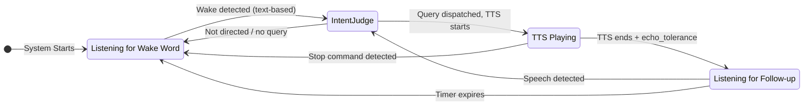

# Listening Flow Specification v2

This document outlines the voice listening architecture. The system uses a **transcript-first** approach where speech is continuously transcribed, and an LLM intent judge extracts queries with full context.

## Architecture Overview

```
┌─────────────────────────────────────────────────────────────────┐
│                         Audio Stream                            │
└───────────────────────────┬─────────────────────────────────────┘
                            │
            ┌───────────────┼───────────────┐
            ▼               ▼               ▼
┌───────────────┐  ┌───────────────┐  ┌───────────────┐
│     VAD       │  │Shush Detector │  │   TTS Output  │
│ (speech gate) │  │(during TTS)   │  │   Tracking    │
└───────┬───────┘  └───────┬───────┘  └───────────────┘
        │                  │
        │                  ▼ (instant TTS interrupt)
        ▼
┌───────────────┐
│    Whisper    │
│ (transcribe)  │
└───────┬───────┘
        │
        ▼
┌───────────────────────────────────────┐
│     Rolling Transcript Buffer         │
│     (2 minutes, with timestamps)      │
│                                       │
│  Segments include:                    │
│  - text, start_time, end_time         │
│  - energy level                       │
│  - is_during_tts flag                 │
└───────────────────┬───────────────────┘
                    │
                    ▼ (on wake detection)
┌───────────────────────────────────────┐
│          Intent Judge LLM             │
│        (gemma4 or main)          │
│                                       │
│  Inputs:                              │
│  - Transcript buffer (recent)         │
│  - Wake word timestamp (if any)       │
│  - Last TTS text + finish time        │
│  - Current state                      │
│                                       │
│  Outputs:                             │
│  - directed: bool                     │
│  - query: "extracted clean query"     │
│  - stop: bool                         │
│  - confidence: high/medium/low        │
│  - reasoning: "brief explanation"     │
└───────────────────┬───────────────────┘
                    │
                    ▼
┌───────────────────────────────────────┐
│           Reply Engine                │
└───────────────────────────────────────┘
```

## Key Design Principles

### 1. Transcript-First

Instead of extracting post-wake-word audio, we:
- Continuously transcribe all speech (VAD-gated)
- Store transcripts with timestamps in a rolling buffer
- Let the intent judge extract the relevant query

**Benefits:**
- Pre-wake-word chatter naturally filtered: "blah blah Jarvis what time is it" → "what time is it"
- Full context available for intent understanding
- Echo detection via multi-layer approach (fuzzy text matching + LLM intent judge)

### 2. Text-Based Wake Detection

Wake word detection operates on the rolling transcript buffer. When Whisper produces text, it is checked for the configured wake word and aliases using fuzzy matching (`rapidfuzz`). This supports arbitrary wake words in any language.

### 3. Context-Aware Intent Judge

The intent judge receives full context and makes intelligent decisions:
- Knows what TTS said → can identify echo vs real speech
- Sees pre-wake-word context → can understand "...what do YOU think, Jarvis?"
- Extracts clean query → removes filler words, false starts

## The Three Listening Modes

### 1. Wake Word Mode (Default)

System is waiting for wake word activation.

**Triggers:**
- Text-based detection finds wake word (or aliases) in transcript

**On trigger:**
1. Start thinking beep immediately and set face state to LISTENING
2. Wait for utterance to complete (user finishes speaking)
3. Send transcript buffer + wake timestamp to intent judge
4. If `directed=true` and `query` exists, dispatch to reply engine
5. If rejected, stop the beep and revert face state to IDLE

### 2. Hot Window Mode

After TTS finishes, allow wake-word-free follow-up.

**Activation:** `echo_tolerance` seconds after TTS ends (allows echo to settle)

**Duration:** Configurable (default: 3 seconds)

**Behaviour:** Speech first passes through an early fuzzy echo check (rapidfuzz `partial_ratio`, threshold 70, with word-count guard to avoid catching mixed echo+speech). Pure echo is silently rejected **without calling the intent judge** — this keeps echo rejection instant and prevents it from blocking the audio loop. The hot window timer is **not** reset on echo rejection. Non-echo speech is sent to the intent judge, but if the judge rejects it, the rejection is overridden — all non-echo speech in the hot window is accepted as a follow-up query.

**Mixed echo+speech handling:** When Whisper merges TTS echo and user speech into one chunk (e.g. mic picks up TTS then user speaks), the word-count guard detects the extra content and lets it through to the intent judge. The judge extracts the user's actual query from the mixed transcript. Post-judge echo checks also use the word-count guard and verify the judge's extracted query isn't itself echo before rejecting.

**Timestamp-based detection:** `was_speech_during_hot_window(utterance_start_time, utterance_end_time)` compares the utterance's time range against the hot window's time span (from schedule to expiry). This eliminates race conditions between slow Whisper transcription and the expiry timer — if the user started speaking during the window, it counts as hot window input regardless of when the transcript arrives. Also handles **overlapping utterances** where VAD triggered during TTS (mic picking up echo) but the utterance extended into the hot window period.

**`could_be_hot_window` (intent judge context):** Derived from timestamp comparison — returns True if the hot window is active, activation is pending, the utterance started within the window span even after expiry, or the utterance overlaps with the span (started before, ended during).

**Expiry:** Timer-based, guaranteed to fire even if no audio

### 3. During TTS

While TTS is playing, echo rejection and stop commands are handled with fast text-based checks (no LLM). This prevents self-loops where the mic picks up TTS output. After TTS finishes, the intent judge takes over.

**Stop detection (two layers):**

1. **Acoustic shush detection (fastest, ~300 ms):** A spectral fricative detector runs directly on raw audio frames in the main audio loop — no Whisper transcription needed. It analyses the frequency profile of each 20 ms frame: a "shhh" sound has high energy in the 2–8 kHz band and very little below 500 Hz (no harmonic structure). When this pattern persists for a configurable number of consecutive frames (default 15 = 300 ms), TTS is interrupted immediately. Brief sibilants in TTS output ("s", "sh" in words) are too short (~50–100 ms) to trigger the detector. The shush detector resets its streak counter whenever TTS is not active.

2. **Text-based stop commands (after Whisper):** Check for "stop", "quiet", "shut up", etc. in the transcribed text. Slower (~1.5–3 s) but catches spoken stop words.

- Intent judge can also detect stop commands

**Echo handling:**
- Transcripts during TTS are flagged with `is_during_tts=true`
- Intent judge uses this context to identify echo

## Rolling Transcript Buffer

### Design

```python
@dataclass
class TranscriptSegment:
    text: str              # Transcribed text
    start_time: float      # Unix timestamp when speech started
    end_time: float        # Unix timestamp when speech ended
    energy: float          # Audio energy level
    is_during_tts: bool    # Whether TTS was playing during this segment

class TranscriptBuffer:
    max_duration_sec: float = 120.0  # 2 minutes - enough for multi-person conversation context
```

### Memory Alignment

The transcript buffer serves as the "live" portion of short-term memory:
- **Transcript buffer:** Last 2 minutes of raw speech (before processing)
- **Short-term memory:** Processed conversation turns (user queries + assistant responses)
- **Long-term memory (diary):** Summarized memories

### Methods

- `add(text, start_time, end_time, energy, is_during_tts)`: Add segment
- `get_since(timestamp)`: Get all segments since a timestamp
- `get_around(timestamp, before_sec, after_sec)`: Get segments in time window
- `format_for_llm(segments)`: Format for intent judge input
- `prune()`: Remove segments older than max_duration

## Intent Judge

### Context Duration & Query Synthesis

The intent judge receives the full transcript buffer (default: 120 seconds / 2 minutes) and **synthesizes a complete query** using conversation context.

This enables Jarvis to **chime into ongoing conversations** between people. When someone asks "Jarvis, what do you think?", the judge uses context to understand what they were discussing and creates a complete, actionable query. Vague references like "that", "it", "this" in the current segment are resolved using previous segments in the buffer (e.g. "I think dinosaurs are cool" + "What do you think about that Jarvis?" → "what do you think about dinosaurs being cool").

**Multi-person conversation example:**
```
[12:28:30] Person A: "I wonder what the weather will be like tomorrow"
[12:28:45] Person B: "Yeah, we should check before planning the picnic"
[12:29:00] Person A: "Jarvis, what do you think?"
```

The intent judge synthesizes: `"what do you think about the weather tomorrow for the picnic"`

### Input Format

```
Transcript (last 120 seconds):
[12:28:30] "I wonder what the weather will be like tomorrow"
[12:28:45] "Yeah, we should check before planning the picnic"
[12:29:00] "Jarvis what do you think"

Wake word detected at: 12:29:00.8 (text-based)
Last TTS: "The weather is sunny and 72 degrees"
TTS finished at: 12:28:02
Current state: wake_word_mode
```

### Output Format

```json
{
  "directed": true,
  "query": "what do you think about the weather tomorrow for the picnic",
  "stop": false,
  "confidence": "high",
  "reasoning": "synthesized context from conversation about weather and picnic"
}
```

### Multi-Layer Echo Detection

Echo detection uses a layered approach for reliability:

1. **Fuzzy text matching (safety net):** `rapidfuzz.fuzz.partial_ratio` compares transcript against last TTS text. Score ≥ 70 = echo. This runs before the intent judge and catches obvious echoes quickly, including in the hot window directed path.
2. **Intent judge (contextual):** Receives `last_tts_text` and timing context. Can identify echo even when fuzzy matching misses subtle cases, and can extract real user speech from mixed echo+speech chunks.

The fuzzy check acts as a fast, reliable safety net. The intent judge provides deeper understanding but may be unreliable with smaller models (e.g. gemma4).

Example:
```
TTS: "The weather is sunny and 72 degrees"
TTS finished: 12:30:14

Transcript:
[12:30:15] "The weather is sunny and 72 degrees" ← Echo (fuzzy score 100, rejected)
[12:30:18] "Ni hao" ← Real speech (fuzzy score < 70, sent to judge)

Judge output: {"directed": true, "query": "Ni hao", "reasoning": "New speech directed at assistant"}
```

## Early Feedback (Beep & Face State)

To minimise perceived latency, audio and visual feedback starts **immediately after Whisper transcription**, before the intent judge runs:

- **Wake word mode:** If the transcribed text contains the wake word (fuzzy-matched), start the thinking beep and set face state to LISTENING.
- **Hot window:** If voice started during an active (or pending) hot window, start the thinking beep and set face state to LISTENING.
- **No trigger:** If neither condition is met, no feedback is given.

If the intent judge later rejects the query (and no hot window override applies), the beep is stopped and face state reverts to IDLE. This brief false-positive beep is acceptable — users prefer immediate acknowledgement over delayed but perfect accuracy.

**Face state is not set during TTS** — the beep is suppressed while TTS is playing to avoid self-triggering.

## Configuration

```json
{
  "transcript_buffer_duration_sec": 120,

  "intent_judge_model": "gemma4:e2b",
  "intent_judge_timeout_sec": 15.0,

  "hot_window_seconds": 3.0,
  "echo_tolerance": 0.3,

  "shush_detection_enabled": true,
  "shush_high_low_ratio": 3.0,
  "shush_energy_floor": 0.002,
  "shush_consecutive_frames": 15
}
```

| Setting | Default | Description |
|---------|---------|-------------|
| `transcript_buffer_duration_sec` | 120 | Duration (seconds) for transcript buffer. Used for both retention and context passed to intent judge. 2 minutes provides good context for multi-person conversations. |
| `shush_detection_enabled` | true | Enable acoustic shush detection during TTS playback. |
| `shush_high_low_ratio` | 3.0 | Minimum ratio of high-band (2–8 kHz) to low-band (0–500 Hz) energy density for a frame to count as fricative. |
| `shush_energy_floor` | 0.002 | Minimum RMS energy to distinguish shush from silence. |
| `shush_consecutive_frames` | 15 | Number of consecutive shush-like frames required before triggering (at 20 ms/frame, 15 = 300 ms). |

Note: Intent judge is always used when available (no enable flag). Falls back to simple wake word detection when Ollama is unavailable.

## State Transitions


```mermaid
stateDiagram-v2
    direction LR
    [*] --> WakeWord: System Starts

    WakeWord: Listening for Wake Word
    HotWindow: Listening for Follow-up
    DuringTTS: TTS Playing

    WakeWord --> IntentJudge: Wake detected (text-based)
    IntentJudge --> DuringTTS: Query dispatched, TTS starts
    IntentJudge --> WakeWord: Not directed / no query
    DuringTTS --> HotWindow: TTS ends + echo_tolerance
    HotWindow --> IntentJudge: Speech detected
    HotWindow --> WakeWord: Timer expires
    DuringTTS --> WakeWord: Stop command detected
```

## Audio Pipeline

```
Microphone Audio
    ↓
Sounddevice Callback → _audio_q
    ↓
Main Loop: Get Frames → VAD Check
    ↓                      ↓ (during TTS)
    │                 Shush Detector
    │                 (spectral check per frame)
    │                      ↓ sustained?
    │                 Interrupt TTS immediately
    ↓
Speech Detected → Accumulate Frames
    ↓
Silence Timeout → Whisper Transcription
    ↓
Add to Transcript Buffer (with timestamps)
    ↓
Wake Detection Check:
    └→ Text contains wake word? → Start thinking beep + LISTENING face
    ↓
If wake detected OR in hot window:
    → Fuzzy echo check (partial_ratio ≥ 70 = echo → reject + reset timer)
    → Send buffer + context to Intent Judge
    ↓
If judge.directed and judge.query:
    → Verify wake word present (wake word mode) or non-echo (hot window)
    → Dispatch query to Reply Engine
If judge rejects but in hot window and non-echo:
    → Override rejection, dispatch as query
```

## Fallback Behaviour

When components are unavailable, the system degrades gracefully:

| Component | Unavailable Behaviour |
|-----------|---------------------|
| Intent Judge | Simple text-based wake word + query extraction; hot window override still applies |
| 16 kHz sample rate | Stream at device native rate, resample to 16 kHz for Whisper |
| Transcript Buffer | Process each utterance independently |

## Future: Acoustic Echo Cancellation

Currently, echo is handled at the transcript level via fuzzy text matching and the intent judge. True acoustic echo cancellation (AEC) would:
- Require the audio output signal (reference)
- Process in real-time with adaptive filtering
- Add 10-50ms latency

**Current recommendation:** The transcript-level echo detection (fuzzy matching + intent judge) is sufficient and simpler. Consider AEC only if transcript-level detection proves inadequate in practice.
