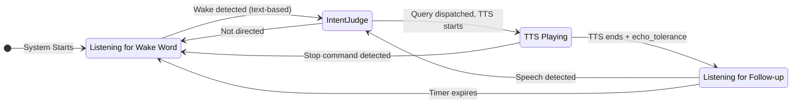

# Listening Flow Specification v2

This document outlines the voice listening architecture. The system uses a **transcript-first** approach where speech is continuously transcribed, and an intent judge classifies engagement using transcript context.

## Architecture Overview

### Capture format and health

The input stream tries mono at the configured sample rate. Unsupported channel
counts or sample rates trigger bounded retries on the same selected input:
mono, stereo and the device's advertised maximum channel count, at the configured
and native rates, without duplicate attempts. Access and device-availability
errors are not retried as format failures. Both the Windows permission probe and
continuous capture use this negotiation and input selection. The system default
is resolved to a concrete input index before the permission probe and model
loading, so changing the default during startup cannot redirect capture. An
unavailable default produces Settings guidance without choosing another input.
Name matching skips
output-only devices; a missing named microphone produces an actionable error
rather than silently selecting another input. Multichannel samples are averaged
to mono before framing and speech detection.

Frames always span the configured 10, 20 or
30 ms at the actual capture rate; unsupported frame durations use 20 ms. Partial
callback blocks are retained until a complete frame is available and discarded
on audio-state resets. WebRTC VAD receives a 16 kHz mono PCM copy, including when
the hardware captures at 44.1 or 48 kHz. Utterances retain native-rate samples
until resampling for Whisper, preserving their duration.

VAD errors emit a single warning and use the configured energy threshold instead
of silently discarding speech. Capture health is checked every five seconds with
a monotonic clock. Missing callbacks, silent samples, callback errors, PortAudio
status flags and dropped queue blocks are reported outside the audio callback.
Warnings are transition-based; dictation pauses suspend health checks. With
`voice_debug`, diagnostics include callback/frame counts, speech-frame counts,
peak level and capture rate, without saving microphone audio. Linux warnings
point users to PipeWire/PulseAudio recording-source routing.

Utterance assembly enforces `max_utterance_ms` during continuous speech as
well as at silent endpoints. While TTS is speaking, `tts_max_utterance_ms`
applies so interruption audio reaches Whisper promptly. Limits count complete
native-rate frames, including pre-roll. Reaching a limit queues the captured
chunk and allows the following frame to start the next utterance.

Audio-frame processing runs on a dedicated serial worker, limited to VAD and
utterance assembly. Intent judging and reply generation on the listener thread
do not block frame consumption. The listener thread owns the PortAudio stream.
Completed utterances are enqueued for a single FIFO Whisper worker.
Transcription results return to the listener loop in order, where transcript
storage and intent processing remain serialised. Both transcription queues are
bounded. A full job backlog reports an explicit warning rather than blocking
microphone-frame consumption or silently losing an utterance. A full result
queue applies cancellable backpressure to Whisper without dropping results.
A dictation pause immediately clears captured audio and invalidates work started
before the pause, including a decode or intent decision that finishes after
resumption. Callback blocks carry the audio generation from before their copy; stale blocks
are discarded after a reset, including blocks already dequeued. Remaining
frames in a dequeued batch cannot append after a buffer reset. Transcript
processing retains the result generation through buffer storage. Listener shutdown discards pending transcriptions and results;
workers receive bounded join grace periods. Invalidated voice queries cannot
start a reply after waiting for the shared query lock, and an invalidated reply
cannot produce speech or a spoken error, including invalidation during thinking
tune teardown. Cancelled language work stops its thinking tune without
overwriting an active dictation face state. In-flight model calls retain their
configured deadlines. Transcript echo flags use the utterance capture interval
against TTS timing. The job carries that capture-time context through Whisper
to echo rejection, stop-command handling and intent processing, so later TTS
playback cannot reclassify an older utterance.

```
┌─────────────────────────────────────────────────────────────────┐
│                         Audio Stream                            │
└───────────────────────────┬─────────────────────────────────────┘
                            │
            ┌───────────────┼───────────────┐
            ▼               ▼               ▼
┌───────────────┐                  ┌───────────────┐
│     VAD       │                  │   TTS Output  │
│ (speech gate) │                  │   Tracking    │
└───────┬───────┘                  └───────────────┘
        │
        ▼
┌───────────────┐
│    Whisper    │
│ (transcribe)  │
└───────┬───────┘
        │
        ▼
┌───────────────────────────────────────┐
│     Rolling Transcript Buffer         │
│     (2 minutes, with timestamps)      │
│                                       │
│  Segments include:                    │
│  - text, start_time, end_time         │
│  - energy level                       │
│  - is_during_tts flag                 │
└───────────────────┬───────────────────┘
                    │
                    ▼ (on wake detection)
┌───────────────────────────────────────┐
│          Intent Judge LLM             │
│        (gemma4 or main)          │
│                                       │
│  Inputs:                              │
│  - Transcript buffer (recent)         │
│  - Wake word timestamp (if any)       │
│  - Last TTS text + finish time        │
│  - Current state                      │
│                                       │
│  Outputs:                             │
│  - directed: bool                     │
│  - stop: bool                         │
│  - confidence: high/medium/low        │
│  - reasoning: "brief explanation"     │
└───────────────────┬───────────────────┘
                    │
                    ▼
┌───────────────────────────────────────┐
│           Reply Engine                │
└───────────────────────────────────────┘
```

## Key Design Principles

### 0. Serialised PortAudio Lifecycle

All stream lifecycle calls (`InputStream`/`OutputStream` construction,
`start`/`stop`/`close`/`abort`) run under the process-wide
`jarvis.utils.audio_lock.portaudio_lock`, shared with the dictation engine,
TTS, and the thinking tune. PortAudio documents stream open/close as not
thread safe; unserialised calls across threads abort the whole app on
Windows (#462, #401, #422). The run loop uses `_serialised_stream` instead
of the raw `with stream:` context manager. Two deliberate exceptions: the
Windows mic-permission probe opens its stream *without* the lock (that open
can hang indefinitely when Windows blocks mic access, and hanging while
holding the process-wide lock would freeze every audio user), and its
timeout path abandons a blocked stream instead of aborting/closing it from
another thread — the check thread may still be inside `start()`/`stop()`
on it, and a cross-thread close is a native use-after-free.

### 1. Transcript-First

Instead of extracting post-wake-word audio, we:
- Continuously transcribe all speech (VAD-gated)
- Store transcripts with timestamps in a rolling buffer
- Let the intent judge classify directedness and cancellation
- Send recognised speech and a separate transcript snapshot to the reply engine

**Benefits:**
- Downstream models distinguish the current request from reference speech and unrelated chatter
- Full context available for intent understanding
- Echo detection via multi-layer approach (fuzzy text matching + LLM intent judge)

### 2. Text-Based Wake Detection

Wake word detection operates on the rolling transcript buffer. When Whisper produces text, it is checked for the configured wake word and aliases using fuzzy matching (`rapidfuzz`). This supports arbitrary wake words in any language.

### 3. Context-Aware Intent Judge

The intent judge receives full context and makes intelligent decisions:
- Knows what TTS said → can identify echo vs real speech
- Sees pre-wake-word context → can understand "...what do YOU think, Jarvis?"
- Classifies current speech without rewriting it

**Gating:** The judge is called only when there is an engagement signal — (a) a wake word was detected in the current utterance, (b) the utterance falls inside (or pending) a hot window, or (c) TTS is currently speaking. Pure ambient speech skips the judge entirely. This keeps the synchronous audio loop from blocking up to `intent_judge_timeout_sec` on every background utterance, which would otherwise freeze the UI when Ollama is slow or contended.

**Alias normalisation:** Before the transcript is sent to the judge, every configured wake-word alias in each segment is replaced with the primary assistant name (case-insensitive, word-boundary-aware). Aliases are Whisper mishearings of the wake word (e.g. "Jervis", "Jaivis" for "Jarvis"); without this step the small judge model sees the alias, doesn't know it refers to the assistant, and can decide the user is addressing a different person. Normalisation happens at prompt-build time only — the raw transcript buffer is untouched.

**Request preservation:** Accepted speech retains its words and casing, including wake words and ASR errors. The intent decision contains no query. Tool arguments are composed by the planner or chat model using the original request and separate transcript context, where the wake word is an address rather than a search term. Names such as "Jarvis Cocker" retain their meaning.

**Model residency (`keep_alive`):** Each intent-judge request asks Ollama to keep the model resident after the call. The default duration is 30 minutes, which avoids cold reloads between utterances. When `cfg.low_power_mode` is true, the duration is 1 minute so the model can unload soon after an active exchange. The trade-off is latency: low-power sessions can pay a cold-load cost after idle periods, while default sessions keep the judge model (default `gemma4:e2b`, ~2 GB) in RAM/VRAM during active voice use.

## Startup & Model Warmup

Before the listener announces "Listening!", it pre-loads every model the first engagement will need. All warmup output is grouped under a single `🔥 Warming up models...` header with indented child status lines, e.g.

```
  🔥 Warming up models...
     🎤 Whisper 'small' loaded on cpu
     💬 Chat model 'llama3.1' ready
     🧠 Intent judge 'gemma4:e2b' ready
🎙️  Listening! Try:
      "How's the weather, Jarvis?"          ← when location is known
      "How's the weather in [your city], Jarvis?"  ← when location is disabled or not configured
      "I just ate a Big Mac, Jarvis."
      "What are you thinking, Jarvis?"
      "What do you know about me, Jarvis?"
```

The weather example adapts to location availability: if `location_enabled` is true, a location source is configured (`location_auto_detect` or a manual `location_ip_address`), **and** the GeoLite2 database is present (`is_location_available()` returns true), the plain form is shown; otherwise the `[your city]` placeholder form is shown so the user understands they must substitute a real city name in their query.

On small models, a caveat line is appended above a more involved example to set expectations (`⚠️ Small model in use (…). Assume it can't infer — spell out the steps for anything more involved:`). The Chrome MCP tip continues to appear as its own block when the browser tool is detected.

**What gets warmed:**
- **Whisper** — loading the model; additionally a silent-audio transcribe so the first real utterance doesn't pay the cold-decode cost. Both the MLX and faster-whisper backends do this.
- **Chat model** (`cfg.llm_chat_model`) — verifies the server is actually Ollama via `GET /api/version`, then issues a minimal `/api/generate` request with the power-mode `keep_alive` (`30m` normally, `1m` in low-power mode) so the weights stay resident.
- **Intent judge model** (the fast tier: `resolve_model(cfg, Tier.FAST)`) — same pattern. If it points at the same Ollama model as the chat model, a single warmup covers both roles (Ollama loads the weights once).

**Whisper backend/model capability:** Auto mode prefers MLX on Apple Silicon only when `mlx-whisper` imports successfully. An explicit `faster-whisper` preference disables MLX, and an explicit `mlx` preference falls back to faster-whisper when MLX is unavailable. `large-v3-turbo` is supported by MLX or by faster-whisper 1.1.0 and newer. If the configuration selects turbo on an unsupported faster-whisper backend, startup loads `medium` instead and prints a warning pointing to Whisper settings or the setup wizard.

**Low-power mode:** When `cfg.low_power_mode` is true, the listener skips chat and intent-judge warmup threads and prints `🌱 Low power mode: LLM warmup skipped`. Whisper still warms because speech recognition needs to be ready before the listener can accept input. The first LLM-backed engagement after startup or idle loads models on demand.

**Concurrency:** LLM warmups run in daemon threads started before Whisper loads, so they overlap with Whisper initialisation. After Whisper finishes, the listener joins the warmup threads with a **single 60 s budget** shared across them all. If the budget is exhausted, the listener continues (with a `⏳ Some models still warming — continuing anyway` notice) and the first engagement pays the cold-load cost on demand.

**Best-effort semantics:** Every warmup path swallows its own errors and returns a bool. A failed warmup prints `⚠️ … warmup failed — will load on first use` but never blocks or crashes the listener — voice input is prioritised over startup latency.

## The Three Listening Modes

### 1. Wake Word Mode (Default)

System is waiting for wake word activation.

**Triggers:**
- Text-based detection finds wake word (or aliases) in transcript

**On trigger:**
1. Start thinking beep immediately and set face state to LISTENING
2. Wait for utterance to complete (user finishes speaking)
3. Send transcript buffer + wake timestamp to intent judge
4. If `directed=true` and the current engagement signal is valid, reject pure hot-window TTS echo even while thinking, then collect the original speech for the reply engine
5. If rejected, stop the beep and revert face state to IDLE

### 2. Hot Window Mode

After TTS finishes, allow wake-word-free follow-up.

**Activation:** `echo_tolerance` seconds after TTS ends (allows echo to settle)

**Duration:** Configurable (default: 3 seconds)

**Timer ownership:** Activation and expiry callbacks belong to the current
scheduled window. Cancelled or superseded callbacks cannot clear a newer
pending activation, open a cancelled window or expire a replacement window.
State changes, timer replacement and shutdown are serialised under one
reentrant lock. Expiry uses the remaining duration from activation, including
notification time. Shutdown rejects further activation/reset scheduling and
hot-window admission; manual expiry also cancels pending activation.


**Behaviour:** Speech first passes through an early fuzzy echo check (rapidfuzz `partial_ratio`, threshold 70, with word-count guard to avoid catching mixed echo+speech). Pure echo is silently rejected **without calling the intent judge** — this keeps echo rejection instant and prevents it from blocking the audio loop. The hot window timer is **not** reset on echo rejection. Non-echo speech is sent to the intent judge, but if the judge rejects it, the rejection is overridden — all non-echo speech in the hot window is accepted as a follow-up query.

**Mixed echo+speech handling:** The early fuzzy echo check and deterministic echo salvage distinguish pure echo from speech that includes a user follow-up. The judge classifies engagement in mixed speech. Accepted text stays separate from the full transcript and last TTS text so downstream models can ignore echo when composing tool arguments.

**Early salvage for echo-prefixed follow-ups:** Before the early fuzzy check rejects a chunk as pure echo, the listener calls `cleanup_leading_echo` to strip any TTS-tail prefix. If exact-word cleanup fails (for example because Whisper mis-transcribed the first echo word — *"explores"* → *"laws"* — breaking the word-level comparison), the listener falls back to `salvage_after_echo_tail`, which scans heard-text word boundaries right-to-left looking for the rightmost 5-word window that fuzzy-matches the TTS tail (`partial_ratio >= 85`) and keeps everything after it. This preserves short follow-ups (*"Who made it?"*) that the existing fuzzy-prefix salvage would otherwise truncate by one word because it prefers the shortest suffix. If the surviving remainder has at least `EchoDetector.min_salvage_words` words (default 3), it replaces the transcript segment text and is treated as the user's follow-up. The same minimum-word threshold is shared by the during-TTS and post-TTS merged-chunk salvage paths so the policy is consistent across all three sites.

**Timestamp-based detection:** `was_speech_during_hot_window(utterance_start_time, utterance_end_time)` compares the utterance's time range against the hot window's time span (from schedule to expiry). This eliminates race conditions between slow Whisper transcription and the expiry timer — if the user started speaking during the window, it counts as hot window input regardless of when the transcript arrives. Also handles **overlapping utterances** where VAD triggered during TTS (mic picking up echo) but the utterance extended into the hot window period.

**`could_be_hot_window` (intent judge context):** Derived from timestamp comparison — returns True if the hot window is active, activation is pending, the utterance started within the window span even after expiry, or the utterance overlaps with the span (started before, ended during).

**Expiry:** Timer-based, guaranteed to fire even if no audio

### 3. During TTS

While TTS is playing, echo rejection and stop commands are handled with fast text-based checks (no LLM). This prevents self-loops where the mic picks up TTS output. After TTS finishes, the intent judge takes over.

**Stop detection:**
- Text-based: Check for "stop", "quiet", "shut up", etc.
- Intent judge can also detect stop commands
- During active TTS, a standalone configured stop phrase (including a fuzzy transcription) retains immediate interruption priority. Longer literal echoes of the current TTS text are rejected even when they contain a configured stop phrase. Unicode punctuation and casing are normalised without language-specific patterns; an appended user command remains eligible for interruption.

**Echo handling:**
- Transcripts during TTS are flagged with `is_during_tts=true`
- Intent judge uses this context to identify echo

## Rolling Transcript Buffer

### Design

```python
@dataclass
class TranscriptSegment:
    text: str              # Transcribed text
    start_time: float      # Unix timestamp when speech started
    end_time: float        # Unix timestamp when speech ended
    energy: float          # Audio energy level
    is_during_tts: bool    # Whether TTS was playing during this segment

class TranscriptBuffer:
    max_duration_sec: float = 120.0  # Ambient speech context for intent judging
```

### Memory Alignment

- **Transcript buffer** (`transcript_buffer_duration_sec`): Rolling raw ambient speech. Separate and potentially longer — in group conversations, 2+ minutes of context lets downstream models resolve references when someone decides to involve Jarvis later in the conversation.
- **Short-term memory** (`dialogue_memory_timeout`): Processed Jarvis interactions (user queries + assistant responses). This window also drives the forced diary update interval.
- **Long-term memory (diary):** Forced update when unsaved messages reach `dialogue_memory_timeout` age. Enrichment retrieves any relevant earlier context from the diary.

### Methods

- `add(text, start_time, end_time, energy, is_during_tts)`: Add segment
- `get_since(timestamp)`: Get all segments since a timestamp
- `get_around(timestamp, before_sec, after_sec)`: Get segments in time window
- `format_for_llm(segments)`: Format for intent judge input
- `prune()`: Remove segments older than max_duration

## Intent Judge

### Context Duration & Query Synthesis

The intent judge receives the timestamped rolling buffer and decides `directed`, `stop`, `confidence` and `reasoning`. It never generates a replacement query. Declaratives addressing the assistant and hot-window follow-ups remain directed; quoted stop commands, narration and pure TTS echo are not cancellation requests.

A voice reply receives the original collected speech and an immutable `SpeechContext` snapshot, captured before waiting for the shared voice/text query lock. The snapshot copies the whole retained buffer, segment timing, TTS overlap, processed markers and last assistant speech. It is request-scoped reference data, redacted before model use, JSON-quoted with escaped fence delimiters, and is not persisted in dialogue or diary memory. Text-chat requests have no ambient transcript snapshot.

The router, planner, step resolver, relevance digests and every reply turn receive this reference context. `toolSearchTool` receives the same context when widening the allow-list. These consumers resolve pronouns, topic-less questions, parent brands, and requests such as "answer that" against relevant earlier speech. The current request takes priority over prior instructions and unrelated threads. Pure echo is rejected by the listener; mixed echo is excluded when composing arguments. Router and memory-extractor caches include a fingerprint of the redacted snapshot, so identical words with different referents cannot reuse an earlier decision.

`evals/test_intent_classifier.py` qualifies local typed classifiers against directedness and cancellation cases, including multilingual speech, quoted stops and echo. Abstentions, malformed answers, truncation and unavailable models count as failures. A classifier replacement must pass this contract independently of downstream query handling.

`evals/run_query_context_comparison.py` replays known-directed synthetic speech through the real router, planner and reply engine. Its rewrite control uses an evaluation-only frozen prompt; its raw-context arm uses production `SpeechContext` transport. Synthetic tools make argument and grounded-answer scoring reproducible. This replay measures downstream accuracy and does not certify listener or classifier safety.

## Early Feedback (Beep & Face State)

To minimise perceived latency, audio and visual feedback starts **immediately after Whisper transcription**, before the intent judge runs:

- **Wake word mode:** If the transcribed text contains the wake word (fuzzy-matched), start the thinking beep and set face state to LISTENING.
- **Hot window:** If voice started during an active (or pending) hot window, start the thinking beep and set face state to LISTENING.
- **No trigger:** If neither condition is met, no feedback is given.

If the intent judge later rejects the query (and no hot window override applies), the beep is stopped and face state reverts to IDLE. This brief false-positive beep is acceptable — users prefer immediate acknowledgement over delayed but perfect accuracy.

**Face state is not set during TTS** — the beep is suppressed while TTS is playing to avoid self-triggering.

## Low-Confidence Rejection Events

`VoiceListener` accepts an optional keyword-only `on_low_confidence` callback.
Both faster-whisper and MLX emit one immutable `LowConfidenceEvent` per segment
discarded because its confidence is below `whisper_min_confidence`, including
very low-confidence segments that only appear in debug logs. The event contains:

- `confidence`: the same score used by the rejection check.
- `transcript`: the full raw segment text, without trimming or truncation.
- `reason`: `"low_confidence"`.

The event is available from `jarvis.listening`. Rejection events travel with
their transcription result and are emitted in segment order on the listener
thread after the result passes shutdown and dictation-generation checks. An
invalidated result emits no events, and invalidation during a callback stops
further event delivery and transcript processing. The callback runs
synchronously and must not block. Consumers that need to update another thread
must enqueue their own work. Callback exceptions are logged by exception type,
without payloads, and do not interrupt voice processing. Events are held only
until their transcription result is processed; the listener does not persist
them.

Segments rejected by the earlier no-speech gate do not emit low-confidence
events. Accepted segments and segments without confidence metadata retain their
existing backend-specific filtering behaviour. The listener does not directly
trigger TTS, update widgets, add transcript-buffer entries, or dispatch queries
for these events. Accepted speech in a mixed utterance continues through the
normal pipeline. Without a callback, the listener filters and logs rejected
segments without notifying any consumer.

The daemon registers a non-blocking consumer that coalesces notifications and
wakes a dedicated notification worker. The worker delivers payload-free visual feedback
independently of synchronous diary and graph processing
through a bundled callback or desktop IPC. The rejected transcript remains in
the listener result only and is not forwarded, logged by the feedback consumer
or persisted. Headless operation emits no desktop protocol, and shutdown drops
pending feedback.

## Configuration

```json
{
  "transcript_buffer_duration_sec": 120,

  "fast_model": "gemma4:e2b",
  "intent_judge_timeout_sec": 6.0,

  "hot_window_seconds": 3.0,
  "echo_tolerance": 0.3
}
```

| Setting | Default | Description |
|---------|---------|-------------|
| `transcript_buffer_duration_sec` | 120 | Duration (seconds) for rolling ambient speech transcript. Provides reference speech for classification, routing, planning and replies when someone involves Jarvis. Separate from dialogue memory. |
| `whisper_min_confidence` | 0.3 | Minimum `avg_logprob`-derived confidence score for a transcribed segment. Segments below this are discarded before the intent judge sees them. |
| `whisper_no_speech_threshold` | 0.5 | Hard cutoff on Whisper's `no_speech_prob` field. Any segment at or above this value is discarded **regardless of `avg_logprob`** — Whisper can be confident about a hallucinated phrase even when no real speech is present (e.g. the "MBC 뉴스" hallucination on background noise). This filter runs before the `avg_logprob` check so it catches high-confidence hallucinations that would otherwise survive. Applies to both the faster-whisper and MLX backends. |

Note: Intent judge is always used when available (no enable flag). Falls back to simple wake word detection when Ollama is unavailable.

## State Transitions


```mermaid
stateDiagram-v2
    direction LR
    [*] --> WakeWord: System Starts

    WakeWord: Listening for Wake Word
    HotWindow: Listening for Follow-up
    DuringTTS: TTS Playing

    WakeWord --> IntentJudge: Wake detected (text-based)
    IntentJudge --> DuringTTS: Query dispatched, TTS starts
    IntentJudge --> WakeWord: Not directed
    DuringTTS --> HotWindow: TTS ends + echo_tolerance
    HotWindow --> IntentJudge: Speech detected
    HotWindow --> WakeWord: Timer expires
    DuringTTS --> WakeWord: Stop command detected
```

## Audio Pipeline

```
Microphone Audio
    ↓
Sounddevice Callback → _audio_q
    ↓
Main Loop: Get Frames → VAD Check
    ↓
Speech Detected → Accumulate Frames
    ↓
Silence Timeout → Bounded FIFO Transcription Jobs
    ↓
Serial Whisper Worker → Transcription Results
    ↓
Main Loop: Transcript and Intent Processing
    ↓
Add to Transcript Buffer (with timestamps)
    ↓
Wake Detection Check:
    └→ Text contains wake word? → Start thinking beep + LISTENING face
    ↓
If wake detected OR in hot window:
    → Fuzzy echo check (partial_ratio ≥ 70 = echo → reject + reset timer)
    → Send buffer + context to Intent Judge
    ↓
If judge.directed and a current engagement signal exists:
    → Verify wake word present (wake word mode) or non-echo (hot window)
    → Collect original speech, then dispatch with a transcript snapshot
If judge rejects but in hot window and non-echo:
    → Override rejection, dispatch as query
```

## Fallback Behaviour

When components are unavailable, the system degrades gracefully:

| Component | Unavailable Behaviour |
|-----------|---------------------|
| Intent Judge | Text-based wake detection with original speech; hot window override still applies |
| Unsupported input format | Retry channel count and native sample rate on the selected device, then convert to 16 kHz mono for Whisper |
| Transcript Buffer | Process each utterance independently |

## Download Recovery

Whisper model loading handles transient download failures automatically:

### Download and loading visibility

LLM startup messages report warmup probe results, not role readiness. Chat, judge and router roles sharing one model share one reported probe; the configured intent deadline is displayed separately, with an explicit notice that the full intent request was not tested. Embeddings always use their own embedding-endpoint probe, even when configured with the same model name. Failure directs users to model availability/settings rather than promising success on first use.

MLX Whisper prepares files through Hugging Face's snapshot cache before loading the model. The desktop displays the Hub's native per-file byte progress rather than an outer file-count bar. Existing caching, authentication, offline cache fallback and transfer resume remain owned by the Hub. The resulting local path is used for both warmup and subsequent transcription so the in-memory MLX model is reused.

Startup distinguishes checking/downloading model files, loading into memory and warming up, and model readiness. Starting the listener thread is not reported as voice readiness. A failed download does not emit a loading or ready message.

### Isolated faster-whisper downloads

Every faster-whisper load, including cache and CPU recovery, prepares complete
local model files before CTranslate2 initialisation. The installed downloader
owns model aliases and Hub cache resolution. Cached files and user-supplied local
directories require non-empty weights, configuration, tokeniser and vocabulary;
an incomplete local directory produces an error rather than downloading a
replacement or a tokeniser.

Network preparation runs in a multiprocessing spawn child, compatible with the
desktop's frozen-process bootstrap. It has a five-minute timeout, is terminated
and reaped on failure, and returns a validated local path or a classified error.
Child exit and timeout stop model loading without falling back to in-process
network work. Visible rate-limit status is preserved through nested errors for bounded
startup retries. Remote preparation that returns incomplete files also receives
up to four retries with exponential backoff (2, 4, 8 and 16 seconds), including
when an upstream cache fallback hides the remote error. An incomplete explicit
local directory fails immediately. Every model constructor receives the
local path and `local_files_only=True`. Cached files remain available after a
failed attempt, retaining the Hub's download resume behaviour.

### Corrupted Cache Recovery

If the HuggingFace model cache is corrupted (e.g. from an interrupted download), the system detects the CTranslate2 "unable to open file" error, deletes the parent `models--` cache directory, and retries the download once. Recovery is attempted at most once per startup, across all device and compute fallbacks. Downloaded files from that attempt remain available to later fallbacks and restarts. Missing-file errors take priority over device and compute classification, including when the cache path contains those terms. If the retry also fails, a message guides the user to manually delete the cache, and the final failure reports the latest loading error.

### Rate Limit Retry (HTTP 429)

When HuggingFace returns HTTP 429 (Too Many Requests), both faster-whisper and MLX Whisper backends retry up to 4 times with exponential backoff (2s, 4s, 8s, 16s). Progress messages inform the user of each retry attempt. If all retries are exhausted, the user is advised to wait and restart.

## Future: Acoustic Echo Cancellation

Currently, echo is handled at the transcript level via fuzzy text matching and the intent judge. True acoustic echo cancellation (AEC) would:
- Require the audio output signal (reference)
- Process in real-time with adaptive filtering
- Add 10-50ms latency

**Current recommendation:** The transcript-level echo detection (fuzzy matching + intent judge) is sufficient and simpler. Consider AEC only if transcript-level detection proves inadequate in practice.

### CUDA decode recovery

- A faster-whisper CUDA runtime failure during warmup or transcription triggers one CPU recovery attempt per listener instance. Both eager failures and errors while consuming lazy segments are handled.
- The loaded model name is retained. CPU decoding uses `float32` when configured, otherwise `int8`, and the CPU decoding optimisations apply immediately.
- A successful recovery retries the current audio once and serves subsequent audio through the shared CPU model. A failed recovery is not retried for every utterance. CPU and unrelated transcription failures do not trigger model replacement.
- Model replacement and lazy segment consumption hold the shared transcription lock. Dictation resolves its model reference under that lock.
- Recovery logs the underlying error and displays a warning that CPU decoding may be slower.

### Speech performance guidance

- The serial transcription worker measures decode elapsed time with a monotonic clock, excluding queue waiting and startup warmup. Stale or empty results do not trigger guidance.
- Three consecutive usable utterances of at least one second that each take at least two seconds and longer than their audio duration produce one warning per listener instance. Fast or short eligible samples reset the streak.
- The warning recommends a smaller supported model while preserving English-only selection, states the accuracy trade-off, and points to the Setup Wizard or Whisper settings. The smallest or an unknown model gets hardware/load guidance instead. User configuration is never changed automatically.
- Debug diagnostics record audio duration, decode duration and the loaded model while gathering samples.
