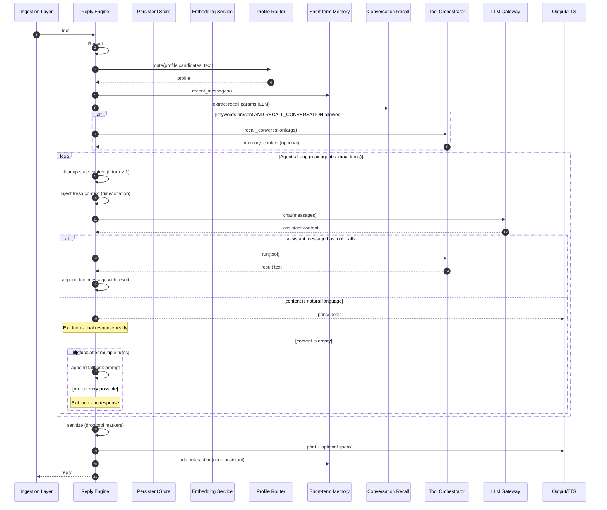

## Reply Flow Spec

This specification documents only the reply flow that begins when a valid user query is dispatched to the reply engine and ends when the assistant's response is produced (console and optionally TTS) and recent dialogue memory is updated.

### Architecture Overview
- Components:
  - Reply Engine (`src/jarvis/reply/engine.py`): Orchestrates profile selection, conversation-memory enrichment, tool-use protocol, messages loop, output, and memory update.
  - Profiles (`src/jarvis/profile/profiles.py`): Provide persona-specific `system_prompt` and a per-profile tool allowlist via `PROFILE_ALLOWED_TOOLS`.
  - LLM Gateway (`src/jarvis/llm.py`): `chat_with_messages` sends the messages array and returns raw JSON; `extract_text_from_response` normalizes content across providers.
  - Conversation Memory (`src/jarvis/memory/conversation.py`): Supplies recent dialogue messages and keyword/time-bounded recall.
  - Enrichment LLM (`src/jarvis/reply/enrichment.py`): Extracts search params (keywords and optional time bounds) from the current query to drive conversation recall.

Design principles enforced by the engine:
- Tool-Profile Separation: Tools define data retrieval; profiles define style/instructions.
- Tool Response Flow: Tools return raw data; formatting/personality is handled by the LLM through the engine's loop.
- Language-Agnostic Design: Prompts and ASR guidance avoid language-specific phrasing.
- Data Privacy: Inputs are redacted and logging is concise and purposeful via `debug_log`.

### Entry and Inputs
- Entry point: the reply engine receives a user query from the ingestion layer.
- Inputs:
  - text (string): a redaction-eligible user query.
  - persistent store: a database-like service, optionally with vector search.
  - configuration: model endpoints, timeouts, feature flags, and tool settings.
  - speech synthesizer (optional): for spoken output and hot-window activation.

### Steps and Branches (Agentic Messages Loop)
1. Redact
   - Redact input to remove sensitive data.

2. Profile Selection
   - Use a lightweight LLM-based router to select the profile; load its system guidance.

3. Recent Dialogue Context
   - Include short-term dialogue memory (last 5 minutes) as prior messages.

4. Conversation Memory Enrichment (optional)
   - Extract search parameters via `extract_search_params_for_memory(query, base_url, chat_model, ...)`.
     - Output fields: `keywords: List[str]`, optional `from`, optional `to`.
   - If `keywords` present, call `search_conversation_memory_by_keywords(db, keywords, from_time, to_time, ...)` to retrieve relevant snippets (bounded by configured max results).
   - Join snippets into a `conversation_context` string for inclusion in the system message.

5. Build Initial Messages
   - messages = [
     {role: system, content: general instructions + profile-specific instructions + ASR note + tool protocol + enrichment },
     ...recent dialogue messages...,
     {role: user, content: redacted user text}
   ]

   System message composition:
   - Start with the profile `system_prompt`.
   - Append ASR note: inputs come from speech transcription and may include errors; prefer user intent and ask brief clarifying questions when uncertain.
   - Append the tool-use protocol (allowed response formats and MCP invocation format if configured).
   - Append `Relevant conversation history:` when enrichment produced context.
   - Append `Tools:` with the dynamically generated tool descriptions (including configured MCP servers, if any) and guidance for preferring real data over shell commands.

6. Agentic Messages Loop with Dynamic Context
   - For each turn of the loop (max `agentic_max_turns` turns, default 8):
     - Clean up stale context messages from previous turns (if turn > 1)
     - Inject fresh context message with current time and location
     - Send messages to LLM and read assistant response
     - Parse response using standard OpenAI-compatible message format:
       - `tool_calls` field: Execute tools and continue loop
       - `thinking` field: Internal reasoning (not shown to user), continue loop
       - `content` field: Natural language response to user

7. Tool and Planning Protocol
   - The LLM responds using standard OpenAI-compatible message format:
     - **Tool calls**: Use `tool_calls` field to request data or actions
     - **Internal reasoning**: Use `thinking` field for step-by-step reasoning (not shown to user)
     - **Final responses**: Use `content` field for natural language answers
     - **Clarifying questions**: Use `content` field when user intent is unclear
   - Each response is appended to messages (preserving `thinking` and `tool_calls` fields) and the loop continues until:
     - LLM provides natural language content
     - Maximum turn limit (8) is reached
     - LLM returns empty response with no tool calls for multiple turns

   Tool protocol details:
   - The LLM requests tools via the standard `tool_calls` field in its message
   - Tool calls are extracted from the `tool_calls` field (OpenAI format)
   - Internal reasoning uses the `thinking` field (not shown to user)
   - Allowed tools: profile allowlist plus MCP (if configured)
   - Duplicate suppression: the engine drops repeated tool calls with identical args from the last few turns and instructs the model to reuse prior results
   - Tool results are appended to messages as `{role: "tool", tool_call_id: "<id>", content: "<text>"}`; errors as `{role: "tool", tool_call_id: "<id>", content: "Error: <message>"}`
   - Fallback prompting: If stuck after multiple turns with tool results, system prompts for final response

8. Output and Memory Update
   - Remove any tool protocol markers (e.g., lines beginning with a reserved prefix) from the final response.
   - Print reply with a concise header; optionally include debug labeling.
   - If speech synthesis is enabled, speak the reply and, upon completion, trigger the follow-up listening window if configured.
   - Add the interaction (sanitized user/assistant texts) to short-term dialogue memory; ignore failures.

### Reply-only Branch Checklist
- Redaction/DB
  - VSS enabled vs disabled
  - Embedding success vs failure (ignored)
- Profile
  - Valid LLM selection vs fallback
- Conversation Memory
  - Params extracted vs empty
  - Tool allowed vs not
  - Tool success with text vs failure/no results
- Document Context
  - Chunks present vs none
- Planning
  - Plan JSON parsed vs invalid
  - Steps include FINAL_RESPONSE / ANALYZE / tool / unknown
  - Completed without final → partial fallback
- Retry
  - Plain chat retry produces text vs empty
- Output
  - TOOL lines sanitized
  - TTS enabled vs disabled
  - Dialogue memory add succeeds vs exception (ignored)

### Mermaid Sequence Diagram (Agentic Messages Loop)


### Notes
- This document intentionally excludes ingestion specifics (voice/stdin, wake/hot-window, stop/echo), tool internals, and diary update scheduling. Those are documented separately.

#### ASR Note
- All user inputs are assumed to originate from speech transcription and may include errors, omissions, or punctuation issues. The system prompt instructs the model to prioritize user intent over literal wording and to ask a brief clarifying question when meaning is uncertain. This guidance is language-agnostic.

#### Dynamic Context Injection
The system injects fresh contextual information before each LLM call in the agentic loop to ensure the model has current, relevant information:

**Context Message Format:**
```
Current context:
• Time: Monday, September 15, 2025 at 17:53 UTC
• Location: San Francisco, CA, United States (America/Los_Angeles)
```

**Implementation Details:**
- Context messages are injected before every turn of the 8-turn agentic loop
- Stale context messages from previous turns are automatically cleaned up
- Context messages are marked with `_is_context_message: True` for identification
- Time is provided in UTC format with day name for clarity
- Location is derived from configured IP address or auto-detection (if enabled)
- Falls back gracefully to "Location: Unknown" if location services unavailable
- Context gathering failures don't interrupt the conversation flow

**Benefits:**
- Time-aware scheduling and deadline suggestions
- Location-relevant recommendations and services
- Fresh context updates throughout multi-turn conversations
- No accumulation of stale temporal information

#### Agentic Flow Examples

**Simple Single-Tool Flow:**
```
User: "What's the weather in London?"
Turn 1: LLM → {content: "", tool_calls: [{function: {name: "webSearch", arguments: {query: "London weather today"}}}]}
Turn 2: LLM → {content: "It's 18°C and sunny in London today with light winds."}
```

**Multi-Step Planning Flow:**
```
User: "Book sushi for two tonight at seven"
Turn 1: LLM → {content: "", thinking: "I need to check restaurant availability first", tool_calls: [{function: {name: "checkAvailability", arguments: {cuisine: "sushi", time: "19:00", party: 2}}}]}
Turn 2: LLM → {content: "7:00 is fully booked. Would you prefer 6:30 PM or 8:15 PM?", thinking: "7:00 is unavailable, I should offer alternatives"}
```

**Iterative Research Flow:**
```
User: "Compare the latest iPhone models"
Turn 1: LLM → {content: "", tool_calls: [{function: {name: "webSearch", arguments: {query: "iPhone 15 models comparison 2024"}}}]}
Turn 2: LLM → {content: "", thinking: "I have basic specs but need pricing information", tool_calls: [{function: {name: "webSearch", arguments: {query: "iPhone 15 Pro Max price official"}}}]}
Turn 3: LLM → {content: "", thinking: "I should also get user reviews for a complete comparison", tool_calls: [{function: {name: "webSearch", arguments: {query: "iPhone 15 Pro vs Pro Max reviews"}}}]}
Turn 4: LLM → {content: "Here's a comprehensive comparison of the iPhone 15 models: [detailed response]"}
```

### Configuration and Defaults
- Timeouts (seconds):
  - `llm_profile_select_timeout_sec` (profile routing)
  - `llm_tools_timeout_sec` (enrichment extraction)
  - `llm_embed_timeout_sec` (vector search)
  - `llm_chat_timeout_sec` (messages loop turn)
- Memory enrichment:
  - `memory_enrichment_max_results` limits recalled snippets.
- Tools and MCP:
  - `PROFILE_ALLOWED_TOOLS` governs default allowlist per profile; MCP servers added from `cfg.mcps`.
- Agentic loop:
  - `agentic_max_turns` maximum turns in the agentic loop (default 8)
- Context injection:
  - `location_enabled` enables/disables location services
  - `location_ip_address` manual IP configuration for geolocation
  - `location_auto_detect` enables automatic IP detection (privacy consideration)
- Output and debugging:
  - `voice_debug` toggles verbose stderr debug vs emoji console output.

### Logging and Privacy
- Use `debug_log` for key steps: `profile`, `memory`, `planning`, and `voice` categories.
- Avoid excessive logging; logs must remain readable and privacy-preserving.


