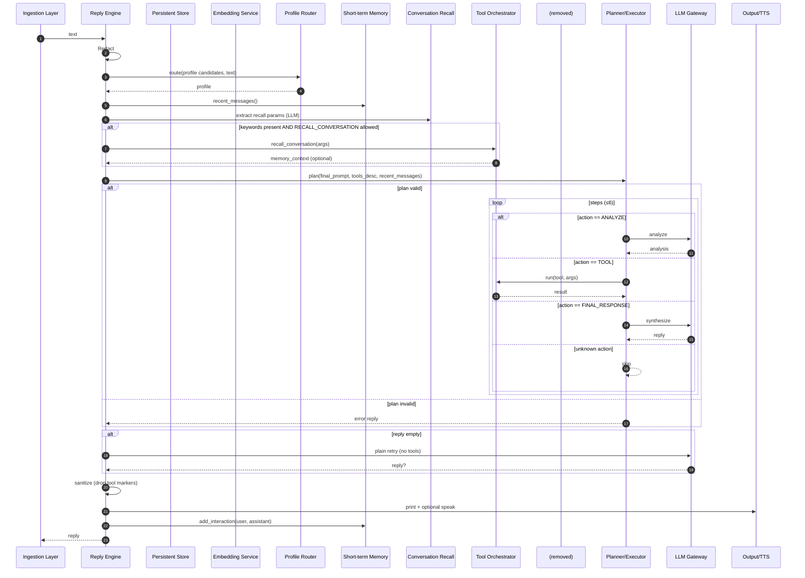

## Reply Flow Spec

This specification documents only the reply flow that begins when a valid user query is dispatched to the reply engine and ends when the assistant's response is produced (console and optionally TTS) and recent dialogue memory is updated.

### Entry and Inputs
- Entry point: the reply engine receives a user query from the ingestion layer.
- Inputs:
  - text (string): a redaction-eligible user query.
  - persistent store: a database-like service, optionally with vector search.
  - configuration: model endpoints, timeouts, feature flags, and tool settings.
  - speech synthesizer (optional): for spoken output and hot-window activation.

### Steps and Branches
1. Redact
   - Redact input to remove sensitive data.

2. Profile Selection
   - Use a lightweight LLM-based router over the configured candidate profiles to select the most appropriate persona/system behavior.
   - Branches:
     - Valid profile token → use it.
     - Ambiguous/invalid → fallback to a sensible default.
   - Load the profile’s system guidance.

3. Recent Dialogue Context
   - Include the short-term dialogue memory (last 5 minutes) for context.

4. Conversation Memory Enrichment (optional)
   - Ask a lightweight LLM to extract conversation-recall parameters as structured data (keywords and optional time range).
   - Branches:
     - Extraction succeeds and conversation recall is allowed:
       - Invoke the conversation-recall capability with the keywords and time bounds.
       - If results are returned, capture them as conversation context.
     - Extraction fails or yields no keywords → skip enrichment.

6. Build Final Prompt
   - Concatenate, in order:
     - Conversation memory section (if any)
     - Document snippet section (if any)
     - Observed text excerpt (redacted tail)

7. Tool Allowlist and Description
   - Determine the allowed tool set from the selected profile.
   - If external tool servers are configured, expose a generic “external tool” channel with guidance and examples.
   - Produce a compact, JSON-only tool protocol description for the model.

8. Multi-step Planning and Execution
   - Always create an explicit JSON plan of steps and then execute them sequentially (limited to a small, safe number of steps).
   - Key branches while executing:
     - Final response step: synthesize a brief answer using available context/results; if empty, fallback to last result snippet or a generic apology.
     - Analyze step: produce a short analysis; append to accumulated results.
     - Tool step: invoke the named tool with arguments; append any textual results.
     - Unknown action: log and skip.
   - If planning fails or yields no steps → return a user-facing error string.
   - If steps complete without a final response → return partial-results fallback or generic apology.

9. Plain Retry (no tools)
   - If the previous step returned no content, retry once with a plain chat completion using the final prompt and no tool protocol.

10. Sanitize, Output, and Memory Update
   - Remove any tool protocol markers (e.g., lines beginning with a reserved prefix) from the final response.
   - Print reply with a concise header; optionally include debug labeling.
   - If speech synthesis is enabled, speak the reply and, upon completion, trigger the follow-up listening window if configured.
   - Add the interaction (sanitized user/assistant texts) to short-term dialogue memory; ignore failures.

### Reply-only Branch Checklist
- Redaction/DB
  - VSS enabled vs disabled
  - Embedding success vs failure (ignored)
- Profile
  - Valid LLM selection vs fallback
- Conversation Memory
  - Params extracted vs empty
  - Tool allowed vs not
  - Tool success with text vs failure/no results
- Document Context
  - Chunks present vs none
- Planning
  - Plan JSON parsed vs invalid
  - Steps include FINAL_RESPONSE / ANALYZE / tool / unknown
  - Completed without final → partial fallback
- Retry
  - Plain chat retry produces text vs empty
- Output
  - TOOL lines sanitized
  - TTS enabled vs disabled
  - Dialogue memory add succeeds vs exception (ignored)

### Mermaid Sequence Diagram (Reply Flow Only)

### Notes
- This document intentionally excludes ingestion specifics (voice/stdin, wake/hot-window, stop/echo), tool internals, and diary update scheduling. Those are documented separately.

